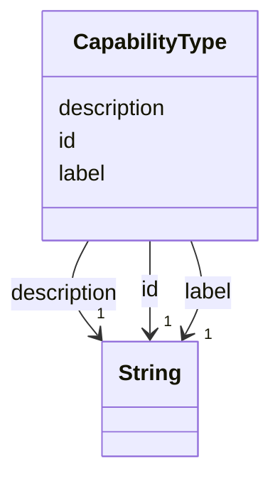

---
search:
  boost: 10.0
---

# Class: CapabilityType 


_A named capability that a PrimitiveTask requires and a RobotType offers. Matching is by identifier; there are no levels or qualifiers. Type-level allocation asks whether a robot type offers every capability a task requires._


<div data-search-exclude markdown="1">


URI: [rcpc:CapabilityType](https://rcpc.for5672/schema/CapabilityType)





<!-- no inheritance hierarchy -->

## Slots

| Name | Cardinality and Range | Description | Inheritance |
| ---  | --- | --- | --- |
| [id](id.md) | 1 <br/> [xsd:string](http://www.w3.org/2001/XMLSchema#string) | Unique identifier within the document set | direct |
| [label](label.md) | 1 <br/> [xsd:string](http://www.w3.org/2001/XMLSchema#string) | Short human-readable name | direct |
| [description](description.md) | 1 <br/> [xsd:string](http://www.w3.org/2001/XMLSchema#string) | What this is, for a human reader | direct |


## Identifier and Mapping Information


### Schema Source


* from schema: https://rcpc.for5672/schema/common


## Mappings

| Mapping Type | Mapped Value |
| ---  | ---  |
| self | rcpc:CapabilityType |
| native | rcpc:CapabilityType |


## LinkML Source

<!-- TODO: investigate https://stackoverflow.com/questions/37606292/how-to-create-tabbed-code-blocks-in-mkdocs-or-sphinx -->

### Direct

<details>
```yaml
name: CapabilityType
description: A named capability that a PrimitiveTask requires and a RobotType offers.
  Matching is by identifier; there are no levels or qualifiers. Type-level allocation
  asks whether a robot type offers every capability a task requires.
from_schema: https://rcpc.for5672/schema/common
slots:
- id
- label
- description
slot_usage:
  label:
    name: label
    required: true
  description:
    name: description
    required: true

```
</details>

### Induced

<details>
```yaml
name: CapabilityType
description: A named capability that a PrimitiveTask requires and a RobotType offers.
  Matching is by identifier; there are no levels or qualifiers. Type-level allocation
  asks whether a robot type offers every capability a task requires.
from_schema: https://rcpc.for5672/schema/common
slot_usage:
  label:
    name: label
    required: true
  description:
    name: description
    required: true
attributes:
  id:
    name: id
    description: Unique identifier within the document set.
    from_schema: https://rcpc.for5672/schema/common
    rank: 1000
    identifier: true
    owner: CapabilityType
    domain_of:
    - CapabilityType
    range: string
    required: true
  label:
    name: label
    description: Short human-readable name.
    from_schema: https://rcpc.for5672/schema/common
    rank: 1000
    owner: CapabilityType
    domain_of:
    - CapabilityType
    range: string
    required: true
  description:
    name: description
    description: What this is, for a human reader.
    from_schema: https://rcpc.for5672/schema/common
    rank: 1000
    owner: CapabilityType
    domain_of:
    - CapabilityType
    range: string
    required: true

```
</details></div>