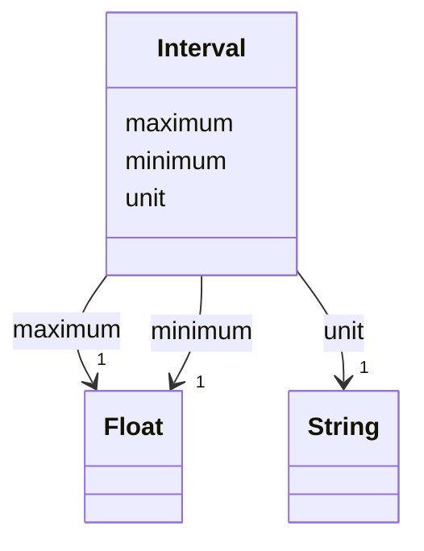

---
search:
  boost: 10.0
---

# Class: Interval 


_A lower and an upper bound with their unit._


<div data-search-exclude markdown="1">


URI: [rcpc:Interval](https://rcpc.for5672/schema/Interval)





<!-- no inheritance hierarchy -->

## Slots

| Name | Cardinality and Range | Description | Inheritance |
| ---  | --- | --- | --- |
| [minimum](minimum.md) | 1 <br/> [xsd:float](http://www.w3.org/2001/XMLSchema#float) | The lower bound | direct |
| [maximum](maximum.md) | 1 <br/> [xsd:float](http://www.w3.org/2001/XMLSchema#float) | The upper bound | direct |
| [unit](unit.md) | 1 <br/> [xsd:string](http://www.w3.org/2001/XMLSchema#string) | The unit of the value, of the coordinates, or of the bounds | direct |


## Identifier and Mapping Information


### Schema Source


* from schema: https://rcpc.for5672/schema/common


## Mappings

| Mapping Type | Mapped Value |
| ---  | ---  |
| self | rcpc:Interval |
| native | rcpc:Interval |


## LinkML Source

<!-- TODO: investigate https://stackoverflow.com/questions/37606292/how-to-create-tabbed-code-blocks-in-mkdocs-or-sphinx -->

### Direct

<details>
```yaml
name: Interval
description: A lower and an upper bound with their unit.
from_schema: https://rcpc.for5672/schema/common
slots:
- minimum
- maximum
- unit
slot_usage:
  minimum:
    name: minimum
    required: true
  maximum:
    name: maximum
    required: true
  unit:
    name: unit
    required: true

```
</details>

### Induced

<details>
```yaml
name: Interval
description: A lower and an upper bound with their unit.
from_schema: https://rcpc.for5672/schema/common
slot_usage:
  minimum:
    name: minimum
    required: true
  maximum:
    name: maximum
    required: true
  unit:
    name: unit
    required: true
attributes:
  minimum:
    name: minimum
    description: The lower bound.
    from_schema: https://rcpc.for5672/schema/common
    rank: 1000
    owner: Interval
    domain_of:
    - Interval
    range: float
    required: true
  maximum:
    name: maximum
    description: The upper bound.
    from_schema: https://rcpc.for5672/schema/common
    rank: 1000
    owner: Interval
    domain_of:
    - Interval
    range: float
    required: true
  unit:
    name: unit
    description: The unit of the value, of the coordinates, or of the bounds.
    from_schema: https://rcpc.for5672/schema/common
    rank: 1000
    owner: Interval
    domain_of:
    - Position
    - Quantity
    - Interval
    range: string
    required: true

```
</details></div>