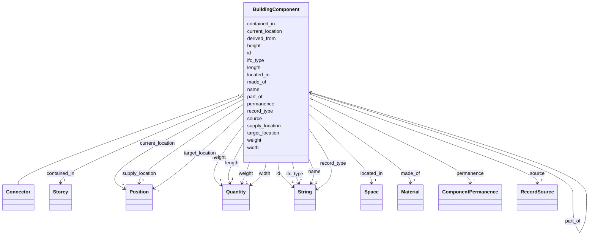

---
search:
  boost: 10.0
---

# Class: BuildingComponent 


_One thing a task acts on. Parsed from the IFC model or derived from a parsed component; permanent or temporary._


<div data-search-exclude markdown="1">


URI: [rcpc:BuildingComponent](https://rcpc.for5672/schema/BuildingComponent)





## Inheritance
* **BuildingComponent**
    * [Connector](Connector.md)


## Slots

| Name | Cardinality and Range | Description | Inheritance |
| ---  | --- | --- | --- |
| [record_type](record_type.md) | 1 <br/> [xsd:string](http://www.w3.org/2001/XMLSchema#string) | Which class in this schema the record belongs to | direct |
| [id](id.md) | 1 <br/> [xsd:string](http://www.w3.org/2001/XMLSchema#string) | The IFC GlobalId in its 22-character form: the entity's own when parsed, mint... | direct |
| [ifc_type](ifc_type.md) | 1 <br/> [xsd:string](http://www.w3.org/2001/XMLSchema#string) | The bare IFC entity name, such as IfcWall | direct |
| [name](name.md) | 1 <br/> [xsd:string](http://www.w3.org/2001/XMLSchema#string) | The IFC Name | direct |
| [made_of](made_of.md) | 1 <br/> [Material](Material.md) | The Material the component is made of, IFC's IfcRelAssociatesMaterial from th... | direct |
| [permanence](permanence.md) | 1 <br/> [ComponentPermanence](ComponentPermanence.md) | Whether the component stays in the building | direct |
| [source](source.md) | 1 <br/> [RecordSource](RecordSource.md) | Where a component or Space came from: parsed from the IFC model, or produced ... | direct |
| [derived_from](derived_from.md) | 1 <br/> [BuildingComponent](BuildingComponent.md) | The IFC-sourced component this one was generated from | direct |
| [part_of](part_of.md) | 1 <br/> [BuildingComponent](BuildingComponent.md) | The assembly this component is a part of, IFC's aggregation from the part's s... | direct |
| [target_location](target_location.md) | 1 <br/> [Position](Position.md) | The centroid of the component's body in the IFC project frame, in the project... | direct |
| [supply_location](supply_location.md) | 1 <br/> [Position](Position.md) | Where the component is delivered or staged | direct |
| [current_location](current_location.md) | 1 <br/> [Position](Position.md) | Where the component is now | direct |
| [located_in](located_in.md) | 1 <br/> [Space](Space.md) | The Space the component's point lies in | direct |
| [contained_in](contained_in.md) | 1 <br/> [Storey](Storey.md) | IFC's containment relation under its own name | direct |
| [length](length.md) | 1 <br/> [Quantity](Quantity.md) | How long the item is | direct |
| [width](width.md) | 1 <br/> [Quantity](Quantity.md) | How wide the item is | direct |
| [height](height.md) | 1 <br/> [Quantity](Quantity.md) | How tall the item is | direct |
| [weight](weight.md) | 1 <br/> [Quantity](Quantity.md) | How much the item weighs | direct |


## Usages

| used by | used in | type | used |
| ---  | --- | --- | --- |
| [BuildingComponent](BuildingComponent.md) | [derived_from](derived_from.md) | range | [BuildingComponent](BuildingComponent.md) |
| [BuildingComponent](BuildingComponent.md) | [part_of](part_of.md) | range | [BuildingComponent](BuildingComponent.md) |
| [Connector](Connector.md) | [derived_from](derived_from.md) | range | [BuildingComponent](BuildingComponent.md) |
| [Connector](Connector.md) | [part_of](part_of.md) | range | [BuildingComponent](BuildingComponent.md) |


## Rules


### 

| Rule Applied | Preconditions | Postconditions | Elseconditions |
|--------------|---------------|----------------|----------------|
| slot_conditions |```{'source': {'equals_string': 'derived'}}``` |```{'derived_from': {'required': True, 'pattern': '^[0-3][0-9A-Za-z_$]{21}$'}}``` | |


## Identifier and Mapping Information


### Schema Source


* from schema: https://rcpc.for5672/schema/product


## Mappings

| Mapping Type | Mapped Value |
| ---  | ---  |
| self | rcpc:BuildingComponent |
| native | rcpc:BuildingComponent |


## LinkML Source

<!-- TODO: investigate https://stackoverflow.com/questions/37606292/how-to-create-tabbed-code-blocks-in-mkdocs-or-sphinx -->

### Direct

<details>
```yaml
name: BuildingComponent
description: One thing a task acts on. Parsed from the IFC model or derived from a
  parsed component; permanent or temporary.
from_schema: https://rcpc.for5672/schema/product
slots:
- record_type
- id
- ifc_type
- name
- made_of
- permanence
- source
- derived_from
- part_of
- target_location
- supply_location
- current_location
- located_in
- contained_in
- length
- width
- height
- weight
slot_usage:
  id:
    name: id
    description: 'The IFC GlobalId in its 22-character form: the entity''s own when
      parsed, minted in the same format when derived.'
    pattern: ^[0-3][0-9A-Za-z_$]{21}$
  permanence:
    name: permanence
    required: true
  source:
    name: source
    required: true
  target_location:
    name: target_location
    required: true
  ifc_type:
    name: ifc_type
    required: true
  made_of:
    name: made_of
    required: true
  part_of:
    name: part_of
    required: true
    pattern: ^$|^[0-3][0-9A-Za-z_$]{21}$
  located_in:
    name: located_in
    required: true
    pattern: ^$|^[0-3][0-9A-Za-z_$]{21}$
  contained_in:
    name: contained_in
    required: true
    pattern: ^$|^[0-3][0-9A-Za-z_$]{21}$
  derived_from:
    name: derived_from
    required: true
    pattern: ^$|^[0-3][0-9A-Za-z_$]{21}$
  supply_location:
    name: supply_location
    required: true
  current_location:
    name: current_location
    required: true
  length:
    name: length
    description: How long the item is. Empty when not measured.
    required: true
  width:
    name: width
    description: How wide the item is. Empty when not measured.
    required: true
  height:
    name: height
    description: How tall the item is. Empty when not measured.
    required: true
  weight:
    name: weight
    description: How much the item weighs. Empty when not measured.
    required: true
rules:
- preconditions:
    slot_conditions:
      source:
        name: source
        equals_string: derived
  postconditions:
    slot_conditions:
      derived_from:
        name: derived_from
        required: true
        pattern: ^[0-3][0-9A-Za-z_$]{21}$
  description: A derived component names the component it came from, with a real id,
    not an empty one.

```
</details>

### Induced

<details>
```yaml
name: BuildingComponent
description: One thing a task acts on. Parsed from the IFC model or derived from a
  parsed component; permanent or temporary.
from_schema: https://rcpc.for5672/schema/product
slot_usage:
  id:
    name: id
    description: 'The IFC GlobalId in its 22-character form: the entity''s own when
      parsed, minted in the same format when derived.'
    pattern: ^[0-3][0-9A-Za-z_$]{21}$
  permanence:
    name: permanence
    required: true
  source:
    name: source
    required: true
  target_location:
    name: target_location
    required: true
  ifc_type:
    name: ifc_type
    required: true
  made_of:
    name: made_of
    required: true
  part_of:
    name: part_of
    required: true
    pattern: ^$|^[0-3][0-9A-Za-z_$]{21}$
  located_in:
    name: located_in
    required: true
    pattern: ^$|^[0-3][0-9A-Za-z_$]{21}$
  contained_in:
    name: contained_in
    required: true
    pattern: ^$|^[0-3][0-9A-Za-z_$]{21}$
  derived_from:
    name: derived_from
    required: true
    pattern: ^$|^[0-3][0-9A-Za-z_$]{21}$
  supply_location:
    name: supply_location
    required: true
  current_location:
    name: current_location
    required: true
  length:
    name: length
    description: How long the item is. Empty when not measured.
    required: true
  width:
    name: width
    description: How wide the item is. Empty when not measured.
    required: true
  height:
    name: height
    description: How tall the item is. Empty when not measured.
    required: true
  weight:
    name: weight
    description: How much the item weighs. Empty when not measured.
    required: true
attributes:
  record_type:
    name: record_type
    description: Which class in this schema the record belongs to.
    from_schema: https://rcpc.for5672/schema/product
    designates_type: true
    owner: BuildingComponent
    domain_of:
    - Storey
    - Space
    - BuildingComponent
    - Material
    - Task
    - Method
    - TaskNetwork
    - TaskInstance
    range: string
    required: true
  id:
    name: id
    description: 'The IFC GlobalId in its 22-character form: the entity''s own when
      parsed, minted in the same format when derived.'
    from_schema: https://rcpc.for5672/schema/common
    identifier: true
    owner: BuildingComponent
    domain_of:
    - CapabilityType
    - MaterialCategory
    - Storey
    - Space
    - BuildingComponent
    - Material
    - RobotUnit
    - PhysicalProperty
    - Sensor
    - OperationalRequirement
    - Safety
    - Activity
    - Task
    - Method
    - TaskNetwork
    - TaskInstance
    range: string
    required: true
    pattern: ^[0-3][0-9A-Za-z_$]{21}$
  ifc_type:
    name: ifc_type
    description: The bare IFC entity name, such as IfcWall. Empty on a derived record,
      which has none.
    from_schema: https://rcpc.for5672/schema/product
    owner: BuildingComponent
    domain_of:
    - BuildingComponent
    range: string
    required: true
  name:
    name: name
    description: The IFC Name. Empty when the IFC file has none.
    from_schema: https://rcpc.for5672/schema/product
    owner: BuildingComponent
    domain_of:
    - Storey
    - Space
    - BuildingComponent
    range: string
    required: true
  made_of:
    name: made_of
    description: The Material the component is made of, IFC's IfcRelAssociatesMaterial
      from the element's side. Empty when the parser derived no material string.
    from_schema: https://rcpc.for5672/schema/product
    owner: BuildingComponent
    domain_of:
    - BuildingComponent
    range: Material
    required: true
  permanence:
    name: permanence
    description: Whether the component stays in the building.
    from_schema: https://rcpc.for5672/schema/product
    owner: BuildingComponent
    domain_of:
    - BuildingComponent
    range: ComponentPermanence
    required: true
  source:
    name: source
    description: 'Where a component or Space came from: parsed from the IFC model,
      or produced by the derivation.'
    from_schema: https://rcpc.for5672/schema/product
    owner: BuildingComponent
    domain_of:
    - Space
    - BuildingComponent
    range: RecordSource
    required: true
  derived_from:
    name: derived_from
    description: The IFC-sourced component this one was generated from. Empty except
      on a derived record.
    from_schema: https://rcpc.for5672/schema/product
    owner: BuildingComponent
    domain_of:
    - BuildingComponent
    range: BuildingComponent
    required: true
    pattern: ^$|^[0-3][0-9A-Za-z_$]{21}$
  part_of:
    name: part_of
    description: The assembly this component is a part of, IFC's aggregation from
      the part's side. Empty on a component that is not part of an assembly.
    from_schema: https://rcpc.for5672/schema/product
    owner: BuildingComponent
    domain_of:
    - BuildingComponent
    range: BuildingComponent
    required: true
    pattern: ^$|^[0-3][0-9A-Za-z_$]{21}$
  target_location:
    name: target_location
    description: The centroid of the component's body in the IFC project frame, in
      the project length unit. Where the design puts it and what a placement task
      binds to.
    from_schema: https://rcpc.for5672/schema/product
    owner: BuildingComponent
    domain_of:
    - BuildingComponent
    range: Position
    required: true
    inlined: true
  supply_location:
    name: supply_location
    description: Where the component is delivered or staged. Empty when not yet known.
    from_schema: https://rcpc.for5672/schema/product
    owner: BuildingComponent
    domain_of:
    - BuildingComponent
    range: Position
    required: true
    inlined: true
  current_location:
    name: current_location
    description: Where the component is now. Written by execution; the model's second
      runtime slot after status. Empty until execution writes one.
    from_schema: https://rcpc.for5672/schema/product
    owner: BuildingComponent
    domain_of:
    - BuildingComponent
    range: Position
    required: true
    inlined: true
  located_in:
    name: located_in
    description: The Space the component's point lies in. Empty for walls and slabs.
    from_schema: https://rcpc.for5672/schema/product
    owner: BuildingComponent
    domain_of:
    - BuildingComponent
    range: Space
    required: true
    pattern: ^$|^[0-3][0-9A-Za-z_$]{21}$
  contained_in:
    name: contained_in
    description: IFC's containment relation under its own name. On a BuildingComponent,
      its storey; on a Space, the storey that aggregates it or, for a derived Space,
      the storey it was cut for. Empty on a part, contained only through its assembly.
    from_schema: https://rcpc.for5672/schema/product
    owner: BuildingComponent
    domain_of:
    - Space
    - BuildingComponent
    range: Storey
    required: true
    pattern: ^$|^[0-3][0-9A-Za-z_$]{21}$
  length:
    name: length
    description: How long the item is. Empty when not measured.
    from_schema: https://rcpc.for5672/schema/common
    owner: BuildingComponent
    domain_of:
    - BuildingComponent
    - PhysicalProperty
    range: Quantity
    required: true
    inlined: true
  width:
    name: width
    description: How wide the item is. Empty when not measured.
    from_schema: https://rcpc.for5672/schema/common
    owner: BuildingComponent
    domain_of:
    - BuildingComponent
    - PhysicalProperty
    range: Quantity
    required: true
    inlined: true
  height:
    name: height
    description: How tall the item is. Empty when not measured.
    from_schema: https://rcpc.for5672/schema/common
    owner: BuildingComponent
    domain_of:
    - BuildingComponent
    - PhysicalProperty
    range: Quantity
    required: true
    inlined: true
  weight:
    name: weight
    description: How much the item weighs. Empty when not measured.
    from_schema: https://rcpc.for5672/schema/common
    owner: BuildingComponent
    domain_of:
    - BuildingComponent
    - PhysicalProperty
    range: Quantity
    required: true
    inlined: true
rules:
- preconditions:
    slot_conditions:
      source:
        name: source
        equals_string: derived
  postconditions:
    slot_conditions:
      derived_from:
        name: derived_from
        required: true
        pattern: ^[0-3][0-9A-Za-z_$]{21}$
  description: A derived component names the component it came from, with a real id,
    not an empty one.

```
</details></div>