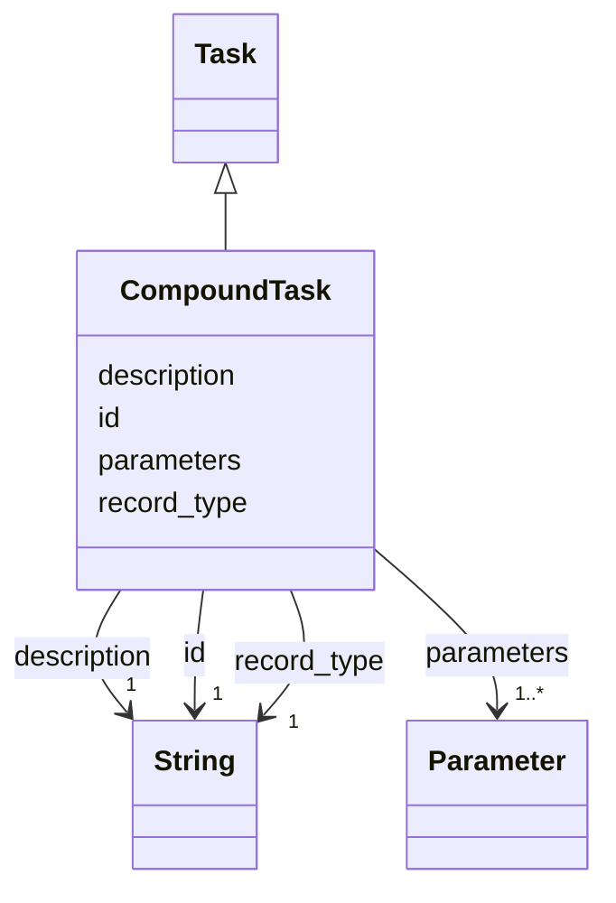

---
search:
  boost: 10.0
---

# Class: CompoundTask 


_HDDL's abstract task: a task performed only by decomposing it through a method. Adds nothing to Task; the class is the kind._


<div data-search-exclude markdown="1">


URI: [rcpc:CompoundTask](https://rcpc.for5672/schema/CompoundTask)





## Inheritance
* [Task](Task.md)
    * **CompoundTask**


## Slots

| Name | Cardinality and Range | Description | Inheritance |
| ---  | --- | --- | --- |
| [record_type](record_type.md) | 1 <br/> [xsd:string](http://www.w3.org/2001/XMLSchema#string) | Which class in this schema the record belongs to | [Task](Task.md) |
| [id](id.md) | 1 <br/> [xsd:string](http://www.w3.org/2001/XMLSchema#string) | The task name, unique among the tasks and methods of the catalogue | [Task](Task.md) |
| [description](description.md) | 1 <br/> [xsd:string](http://www.w3.org/2001/XMLSchema#string) | What this is, in one or two plain sentences | [Task](Task.md) |
| [parameters](parameters.md) | 1..* <br/> [Parameter](Parameter.md) | The declared parameters, keyed by name | [Task](Task.md) |


## Usages

| used by | used in | type | used |
| ---  | --- | --- | --- |
| [Method](Method.md) | [compound_task](compound_task.md) | range | [CompoundTask](CompoundTask.md) |
| [Subtask](Subtask.md) | [compound_task](compound_task.md) | range | [CompoundTask](CompoundTask.md) |
| [CompoundTaskInstance](CompoundTaskInstance.md) | [compound_task](compound_task.md) | range | [CompoundTask](CompoundTask.md) |


## Identifier and Mapping Information


### Schema Source


* from schema: https://rcpc.for5672/schema/process


## Mappings

| Mapping Type | Mapped Value |
| ---  | ---  |
| self | rcpc:CompoundTask |
| native | rcpc:CompoundTask |


## LinkML Source

<!-- TODO: investigate https://stackoverflow.com/questions/37606292/how-to-create-tabbed-code-blocks-in-mkdocs-or-sphinx -->

### Direct

<details>
```yaml
name: CompoundTask
description: 'HDDL''s abstract task: a task performed only by decomposing it through
  a method. Adds nothing to Task; the class is the kind.'
from_schema: https://rcpc.for5672/schema/process
is_a: Task

```
</details>

### Induced

<details>
```yaml
name: CompoundTask
description: 'HDDL''s abstract task: a task performed only by decomposing it through
  a method. Adds nothing to Task; the class is the kind.'
from_schema: https://rcpc.for5672/schema/process
is_a: Task
attributes:
  record_type:
    name: record_type
    description: Which class in this schema the record belongs to.
    from_schema: https://rcpc.for5672/schema/product
    designates_type: true
    owner: CompoundTask
    domain_of:
    - Storey
    - Space
    - BuildingComponent
    - Material
    - Task
    - Method
    - TaskNetwork
    - TaskInstance
    range: string
    required: true
  id:
    name: id
    description: The task name, unique among the tasks and methods of the catalogue.
    from_schema: https://rcpc.for5672/schema/common
    identifier: true
    owner: CompoundTask
    domain_of:
    - CapabilityType
    - MaterialCategory
    - Storey
    - Space
    - BuildingComponent
    - Material
    - RobotUnit
    - PhysicalProperty
    - Sensor
    - OperationalRequirement
    - Safety
    - Activity
    - Task
    - Method
    - TaskNetwork
    - TaskInstance
    range: string
    required: true
    pattern: ^[A-Za-z][A-Za-z0-9_]*$
  description:
    name: description
    description: What this is, in one or two plain sentences.
    from_schema: https://rcpc.for5672/schema/common
    owner: CompoundTask
    domain_of:
    - CapabilityType
    - MaterialCategory
    - Task
    - Method
    range: string
    required: true
  parameters:
    name: parameters
    description: The declared parameters, keyed by name.
    from_schema: https://rcpc.for5672/schema/process
    rank: 1000
    owner: CompoundTask
    domain_of:
    - Task
    - Method
    range: Parameter
    required: true
    multivalued: true
    inlined: true

```
</details></div>