---
search:
  boost: 10.0
---

# Class: Connector 


_A door, an unfilled opening, or a stair as one node: the component a task installs and the passage a robot fits through._


<div data-search-exclude markdown="1">


URI: [rcpc:Connector](https://rcpc.for5672/schema/Connector)

```mermaid
 classDiagram
    class Connector
    click Connector href "../Connector/"
      BuildingComponent <|-- Connector
        click BuildingComponent href "../BuildingComponent/"
      
      Connector : clear_height
        
          
    
        
        
        Connector --> "1" Quantity : clear_height
        click Quantity href "../Quantity/"
    

        
      Connector : clear_width
        
          
    
        
        
        Connector --> "1" Quantity : clear_width
        click Quantity href "../Quantity/"
    

        
      Connector : connects
        
          
    
        
        
        Connector --> "1..*" Space : connects
        click Space href "../Space/"
    

        
      Connector : contained_in
        
          
    
        
        
        Connector --> "1" Storey : contained_in
        click Storey href "../Storey/"
    

        
      Connector : current_location
        
          
    
        
        
        Connector --> "1" Position : current_location
        click Position href "../Position/"
    

        
      Connector : derived_from
        
          
    
        
        
        Connector --> "1" BuildingComponent : derived_from
        click BuildingComponent href "../BuildingComponent/"
    

        
      Connector : height
        
          
    
        
        
        Connector --> "1" Quantity : height
        click Quantity href "../Quantity/"
    

        
      Connector : id
        
          
    
        
        
        Connector --> "1" String : id
        click String href "../http://www.w3.org/2001/XMLSchema#string/"
    

        
      Connector : ifc_type
        
          
    
        
        
        Connector --> "1" String : ifc_type
        click String href "../http://www.w3.org/2001/XMLSchema#string/"
    

        
      Connector : kind
        
          
    
        
        
        Connector --> "1" ConnectorKind : kind
        click ConnectorKind href "../ConnectorKind/"
    

        
      Connector : length
        
          
    
        
        
        Connector --> "1" Quantity : length
        click Quantity href "../Quantity/"
    

        
      Connector : located_in
        
          
    
        
        
        Connector --> "1" Space : located_in
        click Space href "../Space/"
    

        
      Connector : material
        
          
    
        
        
        Connector --> "1" MaterialName : material
        click MaterialName href "../MaterialName/"
    

        
      Connector : name
        
          
    
        
        
        Connector --> "1" String : name
        click String href "../http://www.w3.org/2001/XMLSchema#string/"
    

        
      Connector : part_of
        
          
    
        
        
        Connector --> "1" BuildingComponent : part_of
        click BuildingComponent href "../BuildingComponent/"
    

        
      Connector : permanence
        
          
    
        
        
        Connector --> "1" ComponentPermanence : permanence
        click ComponentPermanence href "../ComponentPermanence/"
    

        
      Connector : record_type
        
          
    
        
        
        Connector --> "1" String : record_type
        click String href "../http://www.w3.org/2001/XMLSchema#string/"
    

        
      Connector : source
        
          
    
        
        
        Connector --> "1" RecordSource : source
        click RecordSource href "../RecordSource/"
    

        
      Connector : supply_location
        
          
    
        
        
        Connector --> "1" Position : supply_location
        click Position href "../Position/"
    

        
      Connector : target_location
        
          
    
        
        
        Connector --> "1" Position : target_location
        click Position href "../Position/"
    

        
      Connector : weight
        
          
    
        
        
        Connector --> "1" Quantity : weight
        click Quantity href "../Quantity/"
    

        
      Connector : width
        
          
    
        
        
        Connector --> "1" Quantity : width
        click Quantity href "../Quantity/"
    

        
      
```





## Inheritance
* [BuildingComponent](BuildingComponent.md)
    * **Connector**


## Slots

| Name | Cardinality and Range | Description | Inheritance |
| ---  | --- | --- | --- |
| [kind](kind.md) | 1 <br/> [ConnectorKind](ConnectorKind.md) | What kind of passage the Connector is | direct |
| [connects](connects.md) | 1..* <br/> [Space](Space.md) | The two Spaces the Connector joins | direct |
| [clear_width](clear_width.md) | 1 <br/> [Quantity](Quantity.md) | The passable width: a door's IFC OverallWidth, a void's opening width, a stai... | direct |
| [clear_height](clear_height.md) | 1 <br/> [Quantity](Quantity.md) | The passable height: a door's IFC OverallHeight, a void's opening height, a s... | direct |
| [record_type](record_type.md) | 1 <br/> [xsd:string](http://www.w3.org/2001/XMLSchema#string) | Which class in this schema the record belongs to | [BuildingComponent](BuildingComponent.md) |
| [id](id.md) | 1 <br/> [xsd:string](http://www.w3.org/2001/XMLSchema#string) | The IFC GlobalId in its 22-character form: the entity's own when parsed, mint... | [BuildingComponent](BuildingComponent.md) |
| [ifc_type](ifc_type.md) | 1 <br/> [xsd:string](http://www.w3.org/2001/XMLSchema#string) | The bare IFC entity name, such as IfcWall | [BuildingComponent](BuildingComponent.md) |
| [name](name.md) | 1 <br/> [xsd:string](http://www.w3.org/2001/XMLSchema#string) | The IFC Name | [BuildingComponent](BuildingComponent.md) |
| [material](material.md) | 1 <br/> [MaterialName](MaterialName.md) | The one material string the parser derives, as the IFC spells it | [BuildingComponent](BuildingComponent.md) |
| [permanence](permanence.md) | 1 <br/> [ComponentPermanence](ComponentPermanence.md) | Whether the component stays in the building | [BuildingComponent](BuildingComponent.md) |
| [source](source.md) | 1 <br/> [RecordSource](RecordSource.md) | Where a component or Space came from: parsed from the IFC model, or produced ... | [BuildingComponent](BuildingComponent.md) |
| [derived_from](derived_from.md) | 1 <br/> [BuildingComponent](BuildingComponent.md) | The IFC-sourced component this one was generated from | [BuildingComponent](BuildingComponent.md) |
| [part_of](part_of.md) | 1 <br/> [BuildingComponent](BuildingComponent.md) | The assembly this component is a part of, IFC's aggregation from the part's s... | [BuildingComponent](BuildingComponent.md) |
| [target_location](target_location.md) | 1 <br/> [Position](Position.md) | The centroid of the component's body in the IFC project frame, in the project... | [BuildingComponent](BuildingComponent.md) |
| [supply_location](supply_location.md) | 1 <br/> [Position](Position.md) | Where the component is delivered or staged | [BuildingComponent](BuildingComponent.md) |
| [current_location](current_location.md) | 1 <br/> [Position](Position.md) | Where the component is now | [BuildingComponent](BuildingComponent.md) |
| [located_in](located_in.md) | 1 <br/> [Space](Space.md) | The Space the component's point lies in | [BuildingComponent](BuildingComponent.md) |
| [contained_in](contained_in.md) | 1 <br/> [Storey](Storey.md) | IFC's containment relation under its own name | [BuildingComponent](BuildingComponent.md) |
| [length](length.md) | 1 <br/> [Quantity](Quantity.md) | How long the item is | [BuildingComponent](BuildingComponent.md) |
| [width](width.md) | 1 <br/> [Quantity](Quantity.md) | How wide the item is | [BuildingComponent](BuildingComponent.md) |
| [height](height.md) | 1 <br/> [Quantity](Quantity.md) | How tall the item is | [BuildingComponent](BuildingComponent.md) |
| [weight](weight.md) | 1 <br/> [Quantity](Quantity.md) | How much the item weighs | [BuildingComponent](BuildingComponent.md) |


## Identifier and Mapping Information


### Schema Source


* from schema: https://rcpc.for5672/schema/product


## Mappings

| Mapping Type | Mapped Value |
| ---  | ---  |
| self | rcpc:Connector |
| native | rcpc:Connector |


## LinkML Source

<!-- TODO: investigate https://stackoverflow.com/questions/37606292/how-to-create-tabbed-code-blocks-in-mkdocs-or-sphinx -->

### Direct

<details>
```yaml
name: Connector
description: 'A door, an unfilled opening, or a stair as one node: the component a
  task installs and the passage a robot fits through.'
from_schema: https://rcpc.for5672/schema/product
is_a: BuildingComponent
slots:
- kind
- connects
- clear_width
- clear_height
slot_usage:
  kind:
    name: kind
    required: true
  connects:
    name: connects
    required: true
    pattern: ^[0-3][0-9A-Za-z_$]{21}$
  clear_width:
    name: clear_width
    required: true
  clear_height:
    name: clear_height
    required: true

```
</details>

### Induced

<details>
```yaml
name: Connector
description: 'A door, an unfilled opening, or a stair as one node: the component a
  task installs and the passage a robot fits through.'
from_schema: https://rcpc.for5672/schema/product
is_a: BuildingComponent
slot_usage:
  kind:
    name: kind
    required: true
  connects:
    name: connects
    required: true
    pattern: ^[0-3][0-9A-Za-z_$]{21}$
  clear_width:
    name: clear_width
    required: true
  clear_height:
    name: clear_height
    required: true
attributes:
  kind:
    name: kind
    description: What kind of passage the Connector is.
    from_schema: https://rcpc.for5672/schema/product
    owner: Connector
    domain_of:
    - Connector
    range: ConnectorKind
    required: true
  connects:
    name: connects
    description: The two Spaces the Connector joins. A stair's two Spaces are on different
      storeys.
    from_schema: https://rcpc.for5672/schema/product
    owner: Connector
    domain_of:
    - Connector
    range: Space
    required: true
    multivalued: true
    pattern: ^[0-3][0-9A-Za-z_$]{21}$
    minimum_cardinality: 2
    maximum_cardinality: 2
  clear_width:
    name: clear_width
    description: 'The passable width: a door''s IFC OverallWidth, a void''s opening
      width, a stair''s flight width. Empty when not read.'
    from_schema: https://rcpc.for5672/schema/product
    owner: Connector
    domain_of:
    - Connector
    range: Quantity
    required: true
    inlined: true
  clear_height:
    name: clear_height
    description: 'The passable height: a door''s IFC OverallHeight, a void''s opening
      height, a stair''s headroom. Empty when not read.'
    from_schema: https://rcpc.for5672/schema/product
    owner: Connector
    domain_of:
    - Connector
    range: Quantity
    required: true
    inlined: true
  record_type:
    name: record_type
    description: Which class in this schema the record belongs to.
    from_schema: https://rcpc.for5672/schema/product
    designates_type: true
    owner: Connector
    domain_of:
    - Storey
    - Space
    - BuildingComponent
    - Task
    - Method
    range: string
    required: true
  id:
    name: id
    description: 'The IFC GlobalId in its 22-character form: the entity''s own when
      parsed, minted in the same format when derived.'
    from_schema: https://rcpc.for5672/schema/common
    identifier: true
    owner: Connector
    domain_of:
    - CapabilityType
    - Storey
    - Space
    - BuildingComponent
    - RobotUnit
    - PhysicalProperty
    - Sensor
    - OperationalRequirement
    - Safety
    - Activity
    - Task
    - Method
    range: string
    required: true
    pattern: ^[0-3][0-9A-Za-z_$]{21}$
  ifc_type:
    name: ifc_type
    description: The bare IFC entity name, such as IfcWall. Empty on a derived record,
      which has none.
    from_schema: https://rcpc.for5672/schema/product
    owner: Connector
    domain_of:
    - BuildingComponent
    range: string
    required: true
  name:
    name: name
    description: The IFC Name. Empty when the IFC file has none.
    from_schema: https://rcpc.for5672/schema/product
    owner: Connector
    domain_of:
    - Storey
    - Space
    - BuildingComponent
    range: string
    required: true
  material:
    name: material
    description: The one material string the parser derives, as the IFC spells it.
      Empty when unresolved.
    from_schema: https://rcpc.for5672/schema/product
    owner: Connector
    domain_of:
    - BuildingComponent
    range: MaterialName
    required: true
  permanence:
    name: permanence
    description: Whether the component stays in the building.
    from_schema: https://rcpc.for5672/schema/product
    owner: Connector
    domain_of:
    - BuildingComponent
    range: ComponentPermanence
    required: true
  source:
    name: source
    description: 'Where a component or Space came from: parsed from the IFC model,
      or produced by the derivation.'
    from_schema: https://rcpc.for5672/schema/product
    owner: Connector
    domain_of:
    - Space
    - BuildingComponent
    range: RecordSource
    required: true
  derived_from:
    name: derived_from
    description: The IFC-sourced component this one was generated from. Empty except
      on a derived record.
    from_schema: https://rcpc.for5672/schema/product
    owner: Connector
    domain_of:
    - BuildingComponent
    range: BuildingComponent
    required: true
    pattern: ^$|^[0-3][0-9A-Za-z_$]{21}$
  part_of:
    name: part_of
    description: The assembly this component is a part of, IFC's aggregation from
      the part's side. Empty on a component that is not part of an assembly.
    from_schema: https://rcpc.for5672/schema/product
    owner: Connector
    domain_of:
    - BuildingComponent
    range: BuildingComponent
    required: true
    pattern: ^$|^[0-3][0-9A-Za-z_$]{21}$
  target_location:
    name: target_location
    description: The centroid of the component's body in the IFC project frame, in
      the project length unit. Where the design puts it and what a placement task
      binds to.
    from_schema: https://rcpc.for5672/schema/product
    owner: Connector
    domain_of:
    - BuildingComponent
    range: Position
    required: true
    inlined: true
  supply_location:
    name: supply_location
    description: Where the component is delivered or staged. Empty when not yet known.
    from_schema: https://rcpc.for5672/schema/product
    owner: Connector
    domain_of:
    - BuildingComponent
    range: Position
    required: true
    inlined: true
  current_location:
    name: current_location
    description: Where the component is now. Written by execution; the model's second
      runtime slot after status. Empty until execution writes one.
    from_schema: https://rcpc.for5672/schema/product
    owner: Connector
    domain_of:
    - BuildingComponent
    range: Position
    required: true
    inlined: true
  located_in:
    name: located_in
    description: The Space the component's point lies in. Empty for walls and slabs.
    from_schema: https://rcpc.for5672/schema/product
    owner: Connector
    domain_of:
    - BuildingComponent
    range: Space
    required: true
    pattern: ^$|^[0-3][0-9A-Za-z_$]{21}$
  contained_in:
    name: contained_in
    description: IFC's containment relation under its own name. On a BuildingComponent,
      its storey; on a Space, the storey that aggregates it or, for a derived Space,
      the storey it was cut for. Empty on a part, contained only through its assembly.
    from_schema: https://rcpc.for5672/schema/product
    owner: Connector
    domain_of:
    - Space
    - BuildingComponent
    range: Storey
    required: true
    pattern: ^$|^[0-3][0-9A-Za-z_$]{21}$
  length:
    name: length
    description: How long the item is. Empty when not measured.
    from_schema: https://rcpc.for5672/schema/common
    owner: Connector
    domain_of:
    - BuildingComponent
    - PhysicalProperty
    range: Quantity
    required: true
    inlined: true
  width:
    name: width
    description: How wide the item is. Empty when not measured.
    from_schema: https://rcpc.for5672/schema/common
    owner: Connector
    domain_of:
    - BuildingComponent
    - PhysicalProperty
    range: Quantity
    required: true
    inlined: true
  height:
    name: height
    description: How tall the item is. Empty when not measured.
    from_schema: https://rcpc.for5672/schema/common
    owner: Connector
    domain_of:
    - BuildingComponent
    - PhysicalProperty
    range: Quantity
    required: true
    inlined: true
  weight:
    name: weight
    description: How much the item weighs. Empty when not measured.
    from_schema: https://rcpc.for5672/schema/common
    owner: Connector
    domain_of:
    - BuildingComponent
    - PhysicalProperty
    range: Quantity
    required: true
    inlined: true

```
</details></div>