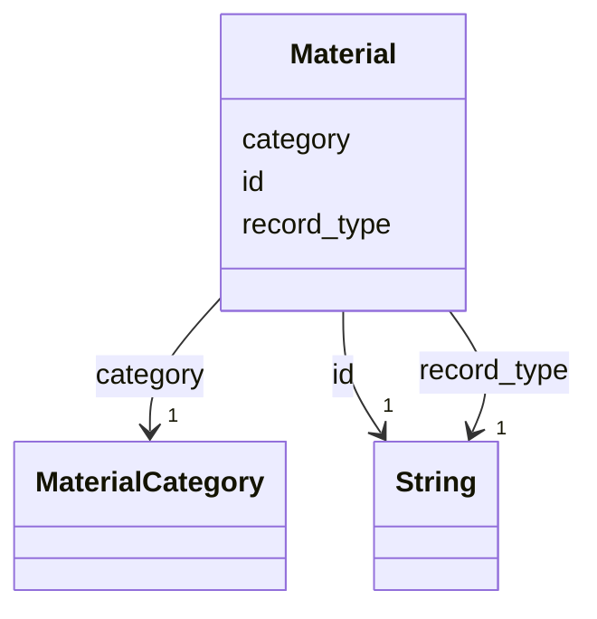

---
search:
  boost: 10.0
---

# Class: Material 


_A material as IFC's IfcMaterial: one record per distinct material string the parser derives, shared by every component made of it._


<div data-search-exclude markdown="1">


URI: [rcpc:Material](https://rcpc.for5672/schema/Material)





<!-- no inheritance hierarchy -->

## Slots

| Name | Cardinality and Range | Description | Inheritance |
| ---  | --- | --- | --- |
| [record_type](record_type.md) | 1 <br/> [xsd:string](http://www.w3.org/2001/XMLSchema#string) | Which class in this schema the record belongs to | direct |
| [id](id.md) | 1 <br/> [xsd:string](http://www.w3.org/2001/XMLSchema#string) | The material string the parser derives, as the IFC spells it: the IfcMaterial... | direct |
| [category](category.md) | 1 <br/> [MaterialCategory](MaterialCategory.md) | The Material's category, IFC's IfcMaterial | direct |


## Usages

| used by | used in | type | used |
| ---  | --- | --- | --- |
| [BuildingComponent](BuildingComponent.md) | [made_of](made_of.md) | range | [Material](Material.md) |
| [Connector](Connector.md) | [made_of](made_of.md) | range | [Material](Material.md) |


## Identifier and Mapping Information


### Schema Source


* from schema: https://rcpc.for5672/schema/product


## Mappings

| Mapping Type | Mapped Value |
| ---  | ---  |
| self | rcpc:Material |
| native | rcpc:Material |


## LinkML Source

<!-- TODO: investigate https://stackoverflow.com/questions/37606292/how-to-create-tabbed-code-blocks-in-mkdocs-or-sphinx -->

### Direct

<details>
```yaml
name: Material
description: 'A material as IFC''s IfcMaterial: one record per distinct material string
  the parser derives, shared by every component made of it.'
from_schema: https://rcpc.for5672/schema/product
slots:
- record_type
- id
- category
slot_usage:
  id:
    name: id
    description: 'The material string the parser derives, as the IFC spells it: the
      IfcMaterial Name, or the layer set''s name where the derivation rule reaches
      that instead.'
  category:
    name: category
    required: true

```
</details>

### Induced

<details>
```yaml
name: Material
description: 'A material as IFC''s IfcMaterial: one record per distinct material string
  the parser derives, shared by every component made of it.'
from_schema: https://rcpc.for5672/schema/product
slot_usage:
  id:
    name: id
    description: 'The material string the parser derives, as the IFC spells it: the
      IfcMaterial Name, or the layer set''s name where the derivation rule reaches
      that instead.'
  category:
    name: category
    required: true
attributes:
  record_type:
    name: record_type
    description: Which class in this schema the record belongs to.
    from_schema: https://rcpc.for5672/schema/product
    designates_type: true
    owner: Material
    domain_of:
    - Storey
    - Space
    - BuildingComponent
    - Material
    - Task
    - Method
    - TaskNetwork
    - TaskInstance
    range: string
    required: true
  id:
    name: id
    description: 'The material string the parser derives, as the IFC spells it: the
      IfcMaterial Name, or the layer set''s name where the derivation rule reaches
      that instead.'
    from_schema: https://rcpc.for5672/schema/common
    identifier: true
    owner: Material
    domain_of:
    - CapabilityType
    - MaterialCategory
    - Storey
    - Space
    - BuildingComponent
    - Material
    - RobotUnit
    - PhysicalProperty
    - Sensor
    - OperationalRequirement
    - Safety
    - Activity
    - Task
    - Method
    - TaskNetwork
    - TaskInstance
    range: string
    required: true
  category:
    name: category
    description: The Material's category, IFC's IfcMaterial.Category as this project's
      vocabulary, assigned by a mapping step after the parse. Empty until mapped.
    from_schema: https://rcpc.for5672/schema/product
    owner: Material
    domain_of:
    - Material
    range: MaterialCategory
    required: true

```
</details></div>