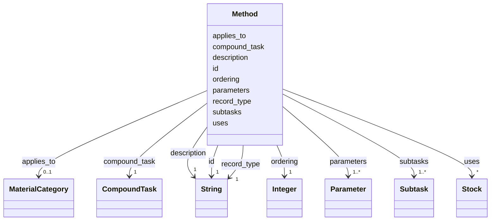

---
search:
  boost: 10.0
---

# Class: Method 


_One way to decompose a compound task into an ordered network of subtasks, for components of one material category or for any component._


<div data-search-exclude markdown="1">


URI: [rcpc:Method](https://rcpc.for5672/schema/Method)





<!-- no inheritance hierarchy -->

## Slots

| Name | Cardinality and Range | Description | Inheritance |
| ---  | --- | --- | --- |
| [record_type](record_type.md) | 1 <br/> [xsd:string](http://www.w3.org/2001/XMLSchema#string) | Which class in this schema the record belongs to | direct |
| [id](id.md) | 1 <br/> [xsd:string](http://www.w3.org/2001/XMLSchema#string) | The method name | direct |
| [description](description.md) | 1 <br/> [xsd:string](http://www.w3.org/2001/XMLSchema#string) | What this is, in one or two plain sentences | direct |
| [compound_task](compound_task.md) | 1 <br/> [CompoundTask](CompoundTask.md) | The compound task a method decomposes, a subtask names, or an instance realis... | direct |
| [applies_to](applies_to.md) | 0..1 <br/> [MaterialCategory](MaterialCategory.md) | The material category of the components a method decomposes its task for; a c... | direct |
| [parameters](parameters.md) | 1..* <br/> [Parameter](Parameter.md) | The declared parameters, keyed by name | direct |
| [subtasks](subtasks.md) | 1..* <br/> [Subtask](Subtask.md) | The subtasks in list order, counted from 1 | direct |
| [ordering](ordering.md) | 1 <br/> [xsd:integer](http://www.w3.org/2001/XMLSchema#integer) | Pairs of positions in the owner's subtask or task list; in each pair the firs... | direct |
| [uses](uses.md) | * <br/> [Stock](Stock.md) | The stocks a method holds one unit of each for its whole span | direct |


## Usages

| used by | used in | type | used |
| ---  | --- | --- | --- |
| [CompoundTaskInstance](CompoundTaskInstance.md) | [decomposed_by](decomposed_by.md) | range | [Method](Method.md) |


## Identifier and Mapping Information


### Schema Source


* from schema: https://rcpc.for5672/schema/process


## Mappings

| Mapping Type | Mapped Value |
| ---  | ---  |
| self | rcpc:Method |
| native | rcpc:Method |


## LinkML Source

<!-- TODO: investigate https://stackoverflow.com/questions/37606292/how-to-create-tabbed-code-blocks-in-mkdocs-or-sphinx -->

### Direct

<details>
```yaml
name: Method
description: One way to decompose a compound task into an ordered network of subtasks,
  for components of one material category or for any component.
from_schema: https://rcpc.for5672/schema/process
slots:
- record_type
- id
- description
- compound_task
- applies_to
- parameters
- subtasks
- ordering
- uses
slot_usage:
  id:
    name: id
    description: The method name.
    pattern: ^[A-Za-z][A-Za-z0-9_]*$
  description:
    name: description
    required: true
  compound_task:
    name: compound_task
    required: true
  parameters:
    name: parameters
    required: true
  subtasks:
    name: subtasks
    range: Subtask
    required: true
    inlined: true
    inlined_as_list: true
    minimum_cardinality: 1
  ordering:
    name: ordering
    required: true

```
</details>

### Induced

<details>
```yaml
name: Method
description: One way to decompose a compound task into an ordered network of subtasks,
  for components of one material category or for any component.
from_schema: https://rcpc.for5672/schema/process
slot_usage:
  id:
    name: id
    description: The method name.
    pattern: ^[A-Za-z][A-Za-z0-9_]*$
  description:
    name: description
    required: true
  compound_task:
    name: compound_task
    required: true
  parameters:
    name: parameters
    required: true
  subtasks:
    name: subtasks
    range: Subtask
    required: true
    inlined: true
    inlined_as_list: true
    minimum_cardinality: 1
  ordering:
    name: ordering
    required: true
attributes:
  record_type:
    name: record_type
    description: Which class in this schema the record belongs to.
    from_schema: https://rcpc.for5672/schema/product
    designates_type: true
    owner: Method
    domain_of:
    - Storey
    - Space
    - BuildingComponent
    - Material
    - Task
    - Method
    - TaskNetwork
    - TaskInstance
    range: string
    required: true
  id:
    name: id
    description: The method name.
    from_schema: https://rcpc.for5672/schema/common
    identifier: true
    owner: Method
    domain_of:
    - CapabilityType
    - MaterialCategory
    - Storey
    - Space
    - BuildingComponent
    - Material
    - ResourceEntry
    - PhysicalProperty
    - Sensor
    - OperationalRequirement
    - Safety
    - Activity
    - Task
    - Method
    - TaskNetwork
    - TaskInstance
    range: string
    required: true
    pattern: ^[A-Za-z][A-Za-z0-9_]*$
  description:
    name: description
    description: What this is, in one or two plain sentences.
    from_schema: https://rcpc.for5672/schema/common
    owner: Method
    domain_of:
    - CapabilityType
    - MaterialCategory
    - Task
    - Method
    range: string
    required: true
  compound_task:
    name: compound_task
    description: The compound task a method decomposes, a subtask names, or an instance
      realises.
    from_schema: https://rcpc.for5672/schema/process
    rank: 1000
    owner: Method
    domain_of:
    - Method
    - Subtask
    - CompoundTaskInstance
    range: CompoundTask
    required: true
  applies_to:
    name: applies_to
    description: The material category of the components a method decomposes its task
      for; a component matches when the Material it is made_of has that category.
      Absent when the method applies to any component.
    from_schema: https://rcpc.for5672/schema/process
    rank: 1000
    owner: Method
    domain_of:
    - Method
    range: MaterialCategory
  parameters:
    name: parameters
    description: The declared parameters, keyed by name.
    from_schema: https://rcpc.for5672/schema/process
    rank: 1000
    owner: Method
    domain_of:
    - Task
    - Method
    range: Parameter
    required: true
    multivalued: true
    inlined: true
  subtasks:
    name: subtasks
    description: The subtasks in list order, counted from 1. On a method, the entries
      of its decomposition; on a compound task instance, the instances that replaced
      it.
    from_schema: https://rcpc.for5672/schema/process
    rank: 1000
    owner: Method
    domain_of:
    - Method
    - CompoundTaskInstance
    range: Subtask
    required: true
    multivalued: true
    inlined: true
    inlined_as_list: true
    minimum_cardinality: 1
  ordering:
    name: ordering
    description: Pairs of positions in the owner's subtask or task list; in each pair
      the first ends before the second starts. Empty when unordered.
    from_schema: https://rcpc.for5672/schema/process
    rank: 1000
    owner: Method
    domain_of:
    - Method
    - TaskNetwork
    range: integer
    required: true
    array:
      exact_number_dimensions: 2
      dimensions:
      - alias: pair
      - exact_cardinality: 2
  uses:
    name: uses
    description: The stocks a method holds one unit of each for its whole span. Absent
      when the method uses no stock.
    from_schema: https://rcpc.for5672/schema/process
    rank: 1000
    owner: Method
    domain_of:
    - Method
    range: Stock
    multivalued: true

```
</details></div>