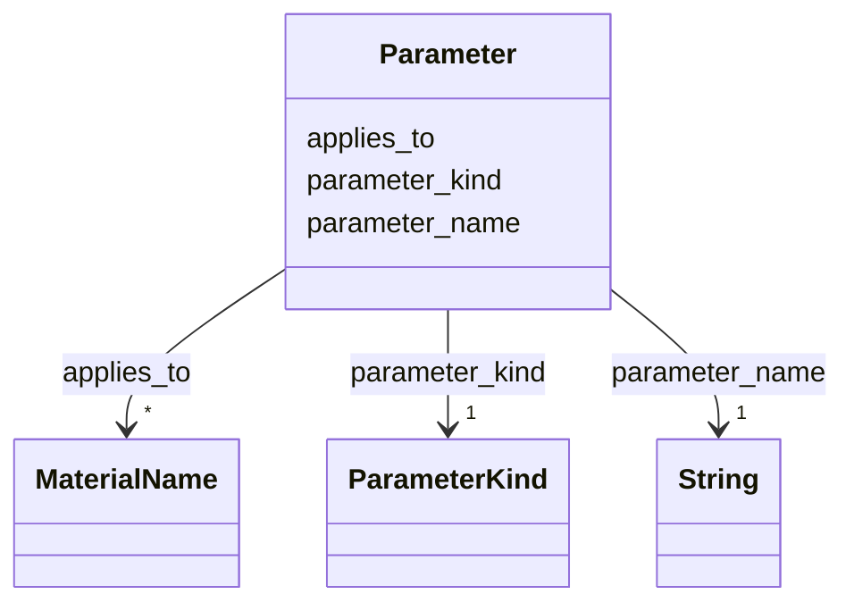

---
search:
  boost: 10.0
---

# Class: Parameter 


_One declared parameter of a task or a method: the kind of object it ranges over and, on a method's component parameter, the materials the method applies to. Written inline, keyed by the parameter's name._


<div data-search-exclude markdown="1">


URI: [rcpc:Parameter](https://rcpc.for5672/schema/Parameter)





<!-- no inheritance hierarchy -->

## Slots

| Name | Cardinality and Range | Description | Inheritance |
| ---  | --- | --- | --- |
| [parameter_name](parameter_name.md) | 1 <br/> [xsd:string](http://www.w3.org/2001/XMLSchema#string) | The parameter's name, a plain word such as c, r, or from | direct |
| [parameter_kind](parameter_kind.md) | 1 <br/> [ParameterKind](ParameterKind.md) | The kind of object the parameter ranges over | direct |
| [applies_to](applies_to.md) | * <br/> [MaterialName](MaterialName.md) | The materials a method applies to, as IFC spells them; a component matches wh... | direct |


## Usages

| used by | used in | type | used |
| ---  | --- | --- | --- |
| [Task](Task.md) | [parameters](parameters.md) | range | [Parameter](Parameter.md) |
| [PrimitiveTask](PrimitiveTask.md) | [parameters](parameters.md) | range | [Parameter](Parameter.md) |
| [CompoundTask](CompoundTask.md) | [parameters](parameters.md) | range | [Parameter](Parameter.md) |


## Identifier and Mapping Information


### Schema Source


* from schema: https://rcpc.for5672/schema/process


## Mappings

| Mapping Type | Mapped Value |
| ---  | ---  |
| self | rcpc:Parameter |
| native | rcpc:Parameter |


## LinkML Source

<!-- TODO: investigate https://stackoverflow.com/questions/37606292/how-to-create-tabbed-code-blocks-in-mkdocs-or-sphinx -->

### Direct

<details>
```yaml
name: Parameter
description: 'One declared parameter of a task or a method: the kind of object it
  ranges over and, on a method''s component parameter, the materials the method applies
  to. Written inline, keyed by the parameter''s name.'
from_schema: https://rcpc.for5672/schema/process
slots:
- parameter_name
- parameter_kind
- applies_to
slot_usage:
  parameter_name:
    name: parameter_name
    required: true
  parameter_kind:
    name: parameter_kind
    required: true

```
</details>

### Induced

<details>
```yaml
name: Parameter
description: 'One declared parameter of a task or a method: the kind of object it
  ranges over and, on a method''s component parameter, the materials the method applies
  to. Written inline, keyed by the parameter''s name.'
from_schema: https://rcpc.for5672/schema/process
slot_usage:
  parameter_name:
    name: parameter_name
    required: true
  parameter_kind:
    name: parameter_kind
    required: true
attributes:
  parameter_name:
    name: parameter_name
    description: The parameter's name, a plain word such as c, r, or from.
    from_schema: https://rcpc.for5672/schema/process
    rank: 1000
    key: true
    owner: Parameter
    domain_of:
    - Parameter
    range: string
    required: true
  parameter_kind:
    name: parameter_kind
    description: The kind of object the parameter ranges over.
    from_schema: https://rcpc.for5672/schema/process
    rank: 1000
    owner: Parameter
    domain_of:
    - Parameter
    range: ParameterKind
    required: true
  applies_to:
    name: applies_to
    description: The materials a method applies to, as IFC spells them; a component
      matches when its material is in the list. Set on a method's component parameter
      only.
    from_schema: https://rcpc.for5672/schema/process
    rank: 1000
    owner: Parameter
    domain_of:
    - Parameter
    range: MaterialName
    multivalued: true

```
</details></div>