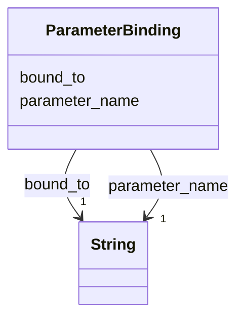

---
search:
  boost: 10.0
---

# Class: ParameterBinding 


_One parameter of a task instance bound to one object. Written inline, keyed by the parameter's name; what kind of object the id names is read from the parameter's declaration on the bound task or method._


<div data-search-exclude markdown="1">


URI: [rcpc:ParameterBinding](https://rcpc.for5672/schema/ParameterBinding)





<!-- no inheritance hierarchy -->

## Slots

| Name | Cardinality and Range | Description | Inheritance |
| ---  | --- | --- | --- |
| [parameter_name](parameter_name.md) | 1 <br/> [xsd:string](http://www.w3.org/2001/XMLSchema#string) | The parameter's name, a plain word such as c, r, or from | direct |
| [bound_to](bound_to.md) | 1 <br/> [xsd:string](http://www.w3.org/2001/XMLSchema#string) | The id of the object the parameter is bound to: a BuildingComponent, a Space,... | direct |


## Usages

| used by | used in | type | used |
| ---  | --- | --- | --- |
| [TaskInstance](TaskInstance.md) | [bindings](bindings.md) | range | [ParameterBinding](ParameterBinding.md) |
| [CompoundTaskInstance](CompoundTaskInstance.md) | [bindings](bindings.md) | range | [ParameterBinding](ParameterBinding.md) |
| [PrimitiveTaskInstance](PrimitiveTaskInstance.md) | [bindings](bindings.md) | range | [ParameterBinding](ParameterBinding.md) |


## Identifier and Mapping Information


### Schema Source


* from schema: https://rcpc.for5672/schema/process


## Mappings

| Mapping Type | Mapped Value |
| ---  | ---  |
| self | rcpc:ParameterBinding |
| native | rcpc:ParameterBinding |


## LinkML Source

<!-- TODO: investigate https://stackoverflow.com/questions/37606292/how-to-create-tabbed-code-blocks-in-mkdocs-or-sphinx -->

### Direct

<details>
```yaml
name: ParameterBinding
description: One parameter of a task instance bound to one object. Written inline,
  keyed by the parameter's name; what kind of object the id names is read from the
  parameter's declaration on the bound task or method.
from_schema: https://rcpc.for5672/schema/process
slots:
- parameter_name
- bound_to
slot_usage:
  bound_to:
    name: bound_to
    required: true

```
</details>

### Induced

<details>
```yaml
name: ParameterBinding
description: One parameter of a task instance bound to one object. Written inline,
  keyed by the parameter's name; what kind of object the id names is read from the
  parameter's declaration on the bound task or method.
from_schema: https://rcpc.for5672/schema/process
slot_usage:
  bound_to:
    name: bound_to
    required: true
attributes:
  parameter_name:
    name: parameter_name
    description: The parameter's name, a plain word such as c, r, or from.
    from_schema: https://rcpc.for5672/schema/process
    rank: 1000
    key: true
    owner: ParameterBinding
    domain_of:
    - Parameter
    - ParameterBinding
    range: string
    required: true
  bound_to:
    name: bound_to
    description: 'The id of the object the parameter is bound to: a BuildingComponent,
      a Space, or a machine such as mason_m1_1, as the parameter''s declared kind
      says.'
    from_schema: https://rcpc.for5672/schema/process
    rank: 1000
    owner: ParameterBinding
    domain_of:
    - ParameterBinding
    range: string
    required: true

```
</details></div>