---
search:
  boost: 10.0
---

# Class: PhysicalProperty 


_CRS group 1: the robot's physical dimensions, hardware, and performance._


<div data-search-exclude markdown="1">


URI: [rcpc:PhysicalProperty](https://rcpc.for5672/schema/PhysicalProperty)

```mermaid
 classDiagram
    class PhysicalProperty
    click PhysicalProperty href "../PhysicalProperty/"
      PhysicalProperty : coordinate_reach
        
          
    
        
        
        PhysicalProperty --> "0..1" Position : coordinate_reach
        click Position href "../Position/"
    

        
      PhysicalProperty : degree_of_freedom
        
          
    
        
        
        PhysicalProperty --> "0..1" Integer : degree_of_freedom
        click Integer href "../http://www.w3.org/2001/XMLSchema#integer/"
    

        
      PhysicalProperty : end_effector
        
          
    
        
        
        PhysicalProperty --> "*" String : end_effector
        click String href "../http://www.w3.org/2001/XMLSchema#string/"
    

        
      PhysicalProperty : height
        
          
    
        
        
        PhysicalProperty --> "0..1" Quantity : height
        click Quantity href "../Quantity/"
    

        
      PhysicalProperty : id
        
          
    
        
        
        PhysicalProperty --> "1" String : id
        click String href "../http://www.w3.org/2001/XMLSchema#string/"
    

        
      PhysicalProperty : length
        
          
    
        
        
        PhysicalProperty --> "0..1" Quantity : length
        click Quantity href "../Quantity/"
    

        
      PhysicalProperty : level_of_autonomy
        
          
    
        
        
        PhysicalProperty --> "0..1" String : level_of_autonomy
        click String href "../http://www.w3.org/2001/XMLSchema#string/"
    

        
      PhysicalProperty : lifting_capacity
        
          
    
        
        
        PhysicalProperty --> "0..1" Quantity : lifting_capacity
        click Quantity href "../Quantity/"
    

        
      PhysicalProperty : load_capacity
        
          
    
        
        
        PhysicalProperty --> "0..1" Quantity : load_capacity
        click Quantity href "../Quantity/"
    

        
      PhysicalProperty : manipulator
        
          
    
        
        
        PhysicalProperty --> "0..1" String : manipulator
        click String href "../http://www.w3.org/2001/XMLSchema#string/"
    

        
      PhysicalProperty : manipulator_position
        
          
    
        
        
        PhysicalProperty --> "0..1" Position : manipulator_position
        click Position href "../Position/"
    

        
      PhysicalProperty : manufacturer
        
          
    
        
        
        PhysicalProperty --> "0..1" String : manufacturer
        click String href "../http://www.w3.org/2001/XMLSchema#string/"
    

        
      PhysicalProperty : mobility
        
          
    
        
        
        PhysicalProperty --> "0..1" String : mobility
        click String href "../http://www.w3.org/2001/XMLSchema#string/"
    

        
      PhysicalProperty : navigation
        
          
    
        
        
        PhysicalProperty --> "0..1" Boolean : navigation
        click Boolean href "../http://www.w3.org/2001/XMLSchema#boolean/"
    

        
      PhysicalProperty : network
        
          
    
        
        
        PhysicalProperty --> "0..1" String : network
        click String href "../http://www.w3.org/2001/XMLSchema#string/"
    

        
      PhysicalProperty : pitch
        
          
    
        
        
        PhysicalProperty --> "0..1" Quantity : pitch
        click Quantity href "../Quantity/"
    

        
      PhysicalProperty : power_source
        
          
    
        
        
        PhysicalProperty --> "0..1" String : power_source
        click String href "../http://www.w3.org/2001/XMLSchema#string/"
    

        
      PhysicalProperty : roll
        
          
    
        
        
        PhysicalProperty --> "0..1" Quantity : roll
        click Quantity href "../Quantity/"
    

        
      PhysicalProperty : run_duration
        
          
    
        
        
        PhysicalProperty --> "0..1" Quantity : run_duration
        click Quantity href "../Quantity/"
    

        
      PhysicalProperty : sensors
        
          
    
        
        
        PhysicalProperty --> "*" Sensor : sensors
        click Sensor href "../Sensor/"
    

        
      PhysicalProperty : speed
        
          
    
        
        
        PhysicalProperty --> "0..1" Quantity : speed
        click Quantity href "../Quantity/"
    

        
      PhysicalProperty : weight
        
          
    
        
        
        PhysicalProperty --> "0..1" Quantity : weight
        click Quantity href "../Quantity/"
    

        
      PhysicalProperty : width
        
          
    
        
        
        PhysicalProperty --> "0..1" Quantity : width
        click Quantity href "../Quantity/"
    

        
      PhysicalProperty : yaw
        
          
    
        
        
        PhysicalProperty --> "0..1" Quantity : yaw
        click Quantity href "../Quantity/"
    

        
      
```





<!-- no inheritance hierarchy -->

## Slots

| Name | Cardinality and Range | Description | Inheritance |
| ---  | --- | --- | --- |
| [id](id.md) | 1 <br/> [xsd:string](http://www.w3.org/2001/XMLSchema#string) | Identifier, unique among instances of its class | direct |
| [manufacturer](manufacturer.md) | 0..1 <br/> [xsd:string](http://www.w3.org/2001/XMLSchema#string) | Who makes the robot | direct |
| [level_of_autonomy](level_of_autonomy.md) | 0..1 <br/> [xsd:string](http://www.w3.org/2001/XMLSchema#string) | How independently the robot performs its tasks | direct |
| [network](network.md) | 0..1 <br/> [xsd:string](http://www.w3.org/2001/XMLSchema#string) | How the robot communicates and exchanges data | direct |
| [length](length.md) | 0..1 <br/> [Quantity](Quantity.md) | How long the item is, recommended in metres | direct |
| [width](width.md) | 0..1 <br/> [Quantity](Quantity.md) | How wide the item is, recommended in metres | direct |
| [height](height.md) | 0..1 <br/> [Quantity](Quantity.md) | How tall the item is, recommended in metres | direct |
| [weight](weight.md) | 0..1 <br/> [Quantity](Quantity.md) | How much the item weighs, recommended in kilograms | direct |
| [load_capacity](load_capacity.md) | 0..1 <br/> [Quantity](Quantity.md) | The maximum weight the robot can carry for extended work, recommended in kilo... | direct |
| [mobility](mobility.md) | 0..1 <br/> [xsd:string](http://www.w3.org/2001/XMLSchema#string) | How the robot moves from one place to another | direct |
| [speed](speed.md) | 0..1 <br/> [Quantity](Quantity.md) | How fast the robot travels, recommended in metres per second | direct |
| [navigation](navigation.md) | 0..1 <br/> [xsd:boolean](http://www.w3.org/2001/XMLSchema#boolean) | Whether the robot can find its own position and plan a path to a destination | direct |
| [power_source](power_source.md) | 0..1 <br/> [xsd:string](http://www.w3.org/2001/XMLSchema#string) | What supplies the robot's energy | direct |
| [run_duration](run_duration.md) | 0..1 <br/> [Quantity](Quantity.md) | How long the robot can run continuously on its power source, recommended in m... | direct |
| [end_effector](end_effector.md) | * <br/> [xsd:string](http://www.w3.org/2001/XMLSchema#string) | The tools the robot's manipulator can attach, such as a bucket or gripper | direct |
| [manipulator](manipulator.md) | 0..1 <br/> [xsd:string](http://www.w3.org/2001/XMLSchema#string) | The robot's arm: the links and joints that perform tasks | direct |
| [coordinate_reach](coordinate_reach.md) | 0..1 <br/> [Position](Position.md) | How far the manipulator reaches along each of the robot's three axes, recomme... | direct |
| [yaw](yaw.md) | 0..1 <br/> [Quantity](Quantity.md) | The manipulator's rotation range around the vertical axis, recommended in deg... | direct |
| [pitch](pitch.md) | 0..1 <br/> [Quantity](Quantity.md) | The manipulator's rotation range around the lateral axis, recommended in degr... | direct |
| [roll](roll.md) | 0..1 <br/> [Quantity](Quantity.md) | The manipulator's rotation range around the longitudinal axis, recommended in... | direct |
| [manipulator_position](manipulator_position.md) | 0..1 <br/> [Position](Position.md) | Where the manipulator is mounted on the robot, a point in the robot's own fra... | direct |
| [degree_of_freedom](degree_of_freedom.md) | 0..1 <br/> [xsd:integer](http://www.w3.org/2001/XMLSchema#integer) | How many axes of the manipulator can rotate or extend | direct |
| [lifting_capacity](lifting_capacity.md) | 0..1 <br/> [Quantity](Quantity.md) | The maximum weight the manipulator can lift during operation, recommended in ... | direct |
| [sensors](sensors.md) | * <br/> [Sensor](Sensor.md) | The sensors mounted on or around the robot | direct |


## Usages

| used by | used in | type | used |
| ---  | --- | --- | --- |
| [RobotUnit](RobotUnit.md) | [physical_property_group](physical_property_group.md) | range | [PhysicalProperty](PhysicalProperty.md) |


## Identifier and Mapping Information


### Schema Source


* from schema: https://rcpc.for5672/schema/resource


## Mappings

| Mapping Type | Mapped Value |
| ---  | ---  |
| self | rcpc:PhysicalProperty |
| native | rcpc:PhysicalProperty |


## LinkML Source

<!-- TODO: investigate https://stackoverflow.com/questions/37606292/how-to-create-tabbed-code-blocks-in-mkdocs-or-sphinx -->

### Direct

<details>
```yaml
name: PhysicalProperty
description: 'CRS group 1: the robot''s physical dimensions, hardware, and performance.'
from_schema: https://rcpc.for5672/schema/resource
slots:
- id
- manufacturer
- level_of_autonomy
- network
- length
- width
- height
- weight
- load_capacity
- mobility
- speed
- navigation
- power_source
- run_duration
- end_effector
- manipulator
- coordinate_reach
- yaw
- pitch
- roll
- manipulator_position
- degree_of_freedom
- lifting_capacity
- sensors

```
</details>

### Induced

<details>
```yaml
name: PhysicalProperty
description: 'CRS group 1: the robot''s physical dimensions, hardware, and performance.'
from_schema: https://rcpc.for5672/schema/resource
attributes:
  id:
    name: id
    description: Identifier, unique among instances of its class.
    from_schema: https://rcpc.for5672/schema/common
    identifier: true
    owner: PhysicalProperty
    domain_of:
    - CapabilityType
    - Storey
    - Space
    - BuildingComponent
    - RobotUnit
    - PhysicalProperty
    - Sensor
    - OperationalRequirement
    - Safety
    - Activity
    - Task
    - Method
    range: string
    required: true
  manufacturer:
    name: manufacturer
    description: Who makes the robot.
    from_schema: https://rcpc.for5672/schema/resource
    owner: PhysicalProperty
    domain_of:
    - PhysicalProperty
    range: string
  level_of_autonomy:
    name: level_of_autonomy
    description: How independently the robot performs its tasks.
    from_schema: https://rcpc.for5672/schema/resource
    owner: PhysicalProperty
    domain_of:
    - PhysicalProperty
    range: string
  network:
    name: network
    description: How the robot communicates and exchanges data.
    from_schema: https://rcpc.for5672/schema/resource
    owner: PhysicalProperty
    domain_of:
    - PhysicalProperty
    range: string
  length:
    name: length
    description: How long the item is, recommended in metres.
    from_schema: https://rcpc.for5672/schema/common
    owner: PhysicalProperty
    domain_of:
    - BuildingComponent
    - PhysicalProperty
    range: Quantity
    inlined: true
  width:
    name: width
    description: How wide the item is, recommended in metres.
    from_schema: https://rcpc.for5672/schema/common
    owner: PhysicalProperty
    domain_of:
    - BuildingComponent
    - PhysicalProperty
    range: Quantity
    inlined: true
  height:
    name: height
    description: How tall the item is, recommended in metres.
    from_schema: https://rcpc.for5672/schema/common
    owner: PhysicalProperty
    domain_of:
    - BuildingComponent
    - PhysicalProperty
    range: Quantity
    inlined: true
  weight:
    name: weight
    description: How much the item weighs, recommended in kilograms.
    from_schema: https://rcpc.for5672/schema/common
    owner: PhysicalProperty
    domain_of:
    - BuildingComponent
    - PhysicalProperty
    range: Quantity
    inlined: true
  load_capacity:
    name: load_capacity
    description: The maximum weight the robot can carry for extended work, recommended
      in kilograms.
    from_schema: https://rcpc.for5672/schema/resource
    owner: PhysicalProperty
    domain_of:
    - PhysicalProperty
    range: Quantity
    inlined: true
  mobility:
    name: mobility
    description: How the robot moves from one place to another.
    from_schema: https://rcpc.for5672/schema/resource
    owner: PhysicalProperty
    domain_of:
    - PhysicalProperty
    range: string
  speed:
    name: speed
    description: How fast the robot travels, recommended in metres per second.
    from_schema: https://rcpc.for5672/schema/resource
    owner: PhysicalProperty
    domain_of:
    - PhysicalProperty
    range: Quantity
    inlined: true
  navigation:
    name: navigation
    description: Whether the robot can find its own position and plan a path to a
      destination.
    from_schema: https://rcpc.for5672/schema/resource
    owner: PhysicalProperty
    domain_of:
    - PhysicalProperty
    range: boolean
  power_source:
    name: power_source
    description: What supplies the robot's energy.
    from_schema: https://rcpc.for5672/schema/resource
    owner: PhysicalProperty
    domain_of:
    - PhysicalProperty
    range: string
  run_duration:
    name: run_duration
    description: How long the robot can run continuously on its power source, recommended
      in minutes.
    from_schema: https://rcpc.for5672/schema/resource
    owner: PhysicalProperty
    domain_of:
    - PhysicalProperty
    range: Quantity
    inlined: true
  end_effector:
    name: end_effector
    description: The tools the robot's manipulator can attach, such as a bucket or
      gripper.
    from_schema: https://rcpc.for5672/schema/resource
    owner: PhysicalProperty
    domain_of:
    - PhysicalProperty
    range: string
    multivalued: true
  manipulator:
    name: manipulator
    description: 'The robot''s arm: the links and joints that perform tasks.'
    from_schema: https://rcpc.for5672/schema/resource
    owner: PhysicalProperty
    domain_of:
    - PhysicalProperty
    range: string
  coordinate_reach:
    name: coordinate_reach
    description: How far the manipulator reaches along each of the robot's three axes,
      recommended in metres. The CRS Coordinate Reach X, Y and Z.
    from_schema: https://rcpc.for5672/schema/resource
    owner: PhysicalProperty
    domain_of:
    - PhysicalProperty
    range: Position
    inlined: true
  yaw:
    name: yaw
    description: The manipulator's rotation range around the vertical axis, recommended
      in degrees.
    from_schema: https://rcpc.for5672/schema/resource
    owner: PhysicalProperty
    domain_of:
    - PhysicalProperty
    range: Quantity
    inlined: true
  pitch:
    name: pitch
    description: The manipulator's rotation range around the lateral axis, recommended
      in degrees.
    from_schema: https://rcpc.for5672/schema/resource
    owner: PhysicalProperty
    domain_of:
    - PhysicalProperty
    range: Quantity
    inlined: true
  roll:
    name: roll
    description: The manipulator's rotation range around the longitudinal axis, recommended
      in degrees.
    from_schema: https://rcpc.for5672/schema/resource
    owner: PhysicalProperty
    domain_of:
    - PhysicalProperty
    range: Quantity
    inlined: true
  manipulator_position:
    name: manipulator_position
    description: Where the manipulator is mounted on the robot, a point in the robot's
      own frame.
    from_schema: https://rcpc.for5672/schema/resource
    owner: PhysicalProperty
    domain_of:
    - PhysicalProperty
    range: Position
    inlined: true
  degree_of_freedom:
    name: degree_of_freedom
    description: How many axes of the manipulator can rotate or extend.
    from_schema: https://rcpc.for5672/schema/resource
    owner: PhysicalProperty
    domain_of:
    - PhysicalProperty
    range: integer
  lifting_capacity:
    name: lifting_capacity
    description: The maximum weight the manipulator can lift during operation, recommended
      in kilograms.
    from_schema: https://rcpc.for5672/schema/resource
    owner: PhysicalProperty
    domain_of:
    - PhysicalProperty
    range: Quantity
    inlined: true
  sensors:
    name: sensors
    description: The sensors mounted on or around the robot.
    from_schema: https://rcpc.for5672/schema/resource
    owner: PhysicalProperty
    domain_of:
    - PhysicalProperty
    range: Sensor
    multivalued: true
    inlined: true
    inlined_as_list: true

```
</details></div>