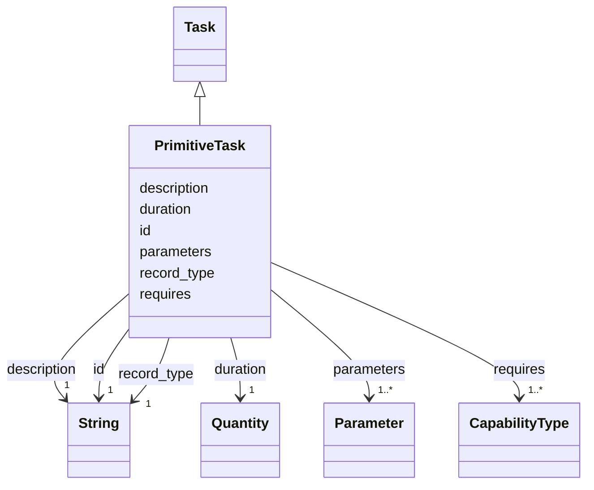

---
search:
  boost: 10.0
---

# Class: PrimitiveTask 


_HDDL's action: a task a robot performs directly, with what performing it requires and how long it takes. Its name is what a behaviour tree registers._


<div data-search-exclude markdown="1">


URI: [rcpc:PrimitiveTask](https://rcpc.for5672/schema/PrimitiveTask)





## Inheritance
* [Task](Task.md)
    * **PrimitiveTask**


## Slots

| Name | Cardinality and Range | Description | Inheritance |
| ---  | --- | --- | --- |
| [requires](requires.md) | 1..* <br/> [CapabilityType](CapabilityType.md) | The capabilities a robot must offer to perform the primitive task | direct |
| [duration](duration.md) | 1 <br/> [Quantity](Quantity.md) | How long one performance of the primitive task takes, recommended in seconds | direct |
| [record_type](record_type.md) | 1 <br/> [xsd:string](http://www.w3.org/2001/XMLSchema#string) | Which class in this schema the record belongs to | [Task](Task.md) |
| [id](id.md) | 1 <br/> [xsd:string](http://www.w3.org/2001/XMLSchema#string) | The task name, unique among the tasks and methods of the catalogue | [Task](Task.md) |
| [description](description.md) | 1 <br/> [xsd:string](http://www.w3.org/2001/XMLSchema#string) | What this is, in one or two plain sentences | [Task](Task.md) |
| [parameters](parameters.md) | 1..* <br/> [Parameter](Parameter.md) | The declared parameters, keyed by name | [Task](Task.md) |


## Usages

| used by | used in | type | used |
| ---  | --- | --- | --- |
| [Subtask](Subtask.md) | [primitive_task](primitive_task.md) | range | [PrimitiveTask](PrimitiveTask.md) |


## Identifier and Mapping Information


### Schema Source


* from schema: https://rcpc.for5672/schema/process


## Mappings

| Mapping Type | Mapped Value |
| ---  | ---  |
| self | rcpc:PrimitiveTask |
| native | rcpc:PrimitiveTask |


## LinkML Source

<!-- TODO: investigate https://stackoverflow.com/questions/37606292/how-to-create-tabbed-code-blocks-in-mkdocs-or-sphinx -->

### Direct

<details>
```yaml
name: PrimitiveTask
description: 'HDDL''s action: a task a robot performs directly, with what performing
  it requires and how long it takes. Its name is what a behaviour tree registers.'
from_schema: https://rcpc.for5672/schema/process
is_a: Task
slots:
- requires
- duration
slot_usage:
  duration:
    name: duration
    required: true

```
</details>

### Induced

<details>
```yaml
name: PrimitiveTask
description: 'HDDL''s action: a task a robot performs directly, with what performing
  it requires and how long it takes. Its name is what a behaviour tree registers.'
from_schema: https://rcpc.for5672/schema/process
is_a: Task
slot_usage:
  duration:
    name: duration
    required: true
attributes:
  requires:
    name: requires
    description: The capabilities a robot must offer to perform the primitive task.
    from_schema: https://rcpc.for5672/schema/process
    rank: 1000
    owner: PrimitiveTask
    domain_of:
    - PrimitiveTask
    range: CapabilityType
    required: true
    multivalued: true
    minimum_cardinality: 1
  duration:
    name: duration
    description: How long one performance of the primitive task takes, recommended
      in seconds.
    from_schema: https://rcpc.for5672/schema/process
    rank: 1000
    owner: PrimitiveTask
    domain_of:
    - PrimitiveTask
    range: Quantity
    required: true
    inlined: true
  record_type:
    name: record_type
    description: Which class in this schema the record belongs to.
    from_schema: https://rcpc.for5672/schema/product
    designates_type: true
    owner: PrimitiveTask
    domain_of:
    - Storey
    - Space
    - BuildingComponent
    - Material
    - Task
    - Method
    range: string
    required: true
  id:
    name: id
    description: The task name, unique among the tasks and methods of the catalogue.
    from_schema: https://rcpc.for5672/schema/common
    identifier: true
    owner: PrimitiveTask
    domain_of:
    - CapabilityType
    - MaterialCategory
    - Storey
    - Space
    - BuildingComponent
    - Material
    - RobotUnit
    - PhysicalProperty
    - Sensor
    - OperationalRequirement
    - Safety
    - Activity
    - Task
    - Method
    range: string
    required: true
    pattern: ^[A-Za-z][A-Za-z0-9_]*$
  description:
    name: description
    description: What this is, in one or two plain sentences.
    from_schema: https://rcpc.for5672/schema/common
    owner: PrimitiveTask
    domain_of:
    - CapabilityType
    - MaterialCategory
    - Task
    - Method
    range: string
    required: true
  parameters:
    name: parameters
    description: The declared parameters, keyed by name.
    from_schema: https://rcpc.for5672/schema/process
    rank: 1000
    owner: PrimitiveTask
    domain_of:
    - Task
    - Method
    range: Parameter
    required: true
    multivalued: true
    inlined: true

```
</details></div>