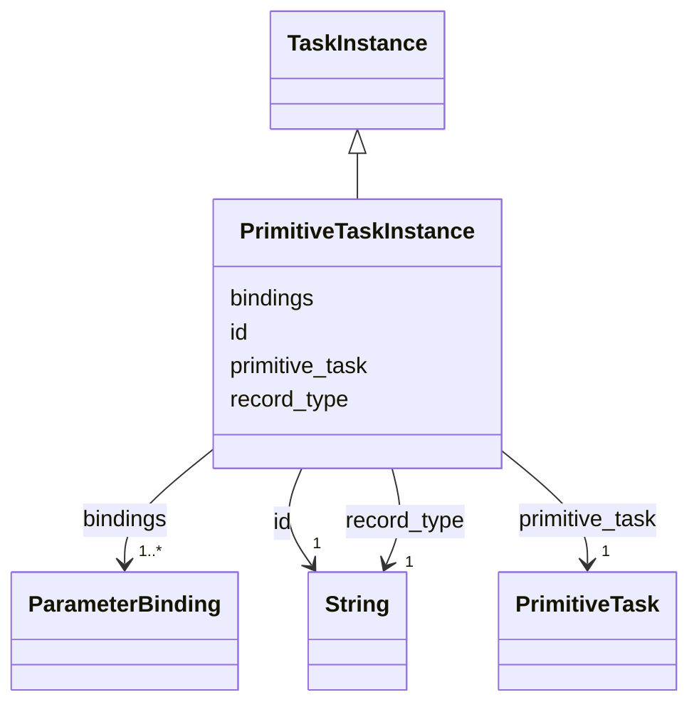

---
search:
  boost: 10.0
---

# Class: PrimitiveTaskInstance 


_One planned occurrence of a primitive task: the action and every parameter of it bound to an object._


<div data-search-exclude markdown="1">


URI: [rcpc:PrimitiveTaskInstance](https://rcpc.for5672/schema/PrimitiveTaskInstance)





## Inheritance
* [TaskInstance](TaskInstance.md)
    * **PrimitiveTaskInstance**


## Slots

| Name | Cardinality and Range | Description | Inheritance |
| ---  | --- | --- | --- |
| [primitive_task](primitive_task.md) | 1 <br/> [PrimitiveTask](PrimitiveTask.md) | The primitive task a subtask names or an instance realises | direct |
| [record_type](record_type.md) | 1 <br/> [xsd:string](http://www.w3.org/2001/XMLSchema#string) | Which class in this schema the record belongs to | [TaskInstance](TaskInstance.md) |
| [id](id.md) | 1 <br/> [xsd:string](http://www.w3.org/2001/XMLSchema#string) | The instance's id, unique within the plan | [TaskInstance](TaskInstance.md) |
| [bindings](bindings.md) | 1..* <br/> [ParameterBinding](ParameterBinding.md) | The instance's parameters bound to object ids, keyed by parameter name | [TaskInstance](TaskInstance.md) |


## Identifier and Mapping Information


### Schema Source


* from schema: https://rcpc.for5672/schema/process


## Mappings

| Mapping Type | Mapped Value |
| ---  | ---  |
| self | rcpc:PrimitiveTaskInstance |
| native | rcpc:PrimitiveTaskInstance |


## LinkML Source

<!-- TODO: investigate https://stackoverflow.com/questions/37606292/how-to-create-tabbed-code-blocks-in-mkdocs-or-sphinx -->

### Direct

<details>
```yaml
name: PrimitiveTaskInstance
description: 'One planned occurrence of a primitive task: the action and every parameter
  of it bound to an object.'
from_schema: https://rcpc.for5672/schema/process
is_a: TaskInstance
slots:
- primitive_task
slot_usage:
  primitive_task:
    name: primitive_task
    required: true

```
</details>

### Induced

<details>
```yaml
name: PrimitiveTaskInstance
description: 'One planned occurrence of a primitive task: the action and every parameter
  of it bound to an object.'
from_schema: https://rcpc.for5672/schema/process
is_a: TaskInstance
slot_usage:
  primitive_task:
    name: primitive_task
    required: true
attributes:
  primitive_task:
    name: primitive_task
    description: The primitive task a subtask names or an instance realises.
    from_schema: https://rcpc.for5672/schema/process
    rank: 1000
    owner: PrimitiveTaskInstance
    domain_of:
    - Subtask
    - PrimitiveTaskInstance
    range: PrimitiveTask
    required: true
  record_type:
    name: record_type
    description: Which class in this schema the record belongs to.
    from_schema: https://rcpc.for5672/schema/product
    designates_type: true
    owner: PrimitiveTaskInstance
    domain_of:
    - Storey
    - Space
    - BuildingComponent
    - Material
    - Task
    - Method
    - TaskNetwork
    - TaskInstance
    range: string
    required: true
  id:
    name: id
    description: The instance's id, unique within the plan.
    from_schema: https://rcpc.for5672/schema/common
    identifier: true
    owner: PrimitiveTaskInstance
    domain_of:
    - CapabilityType
    - MaterialCategory
    - Storey
    - Space
    - BuildingComponent
    - Material
    - ResourceEntry
    - PhysicalProperty
    - Sensor
    - OperationalRequirement
    - Safety
    - Activity
    - Task
    - Method
    - TaskNetwork
    - TaskInstance
    range: string
    required: true
  bindings:
    name: bindings
    description: The instance's parameters bound to object ids, keyed by parameter
      name.
    from_schema: https://rcpc.for5672/schema/process
    rank: 1000
    owner: PrimitiveTaskInstance
    domain_of:
    - TaskInstance
    range: ParameterBinding
    required: true
    multivalued: true
    inlined: true

```
</details></div>