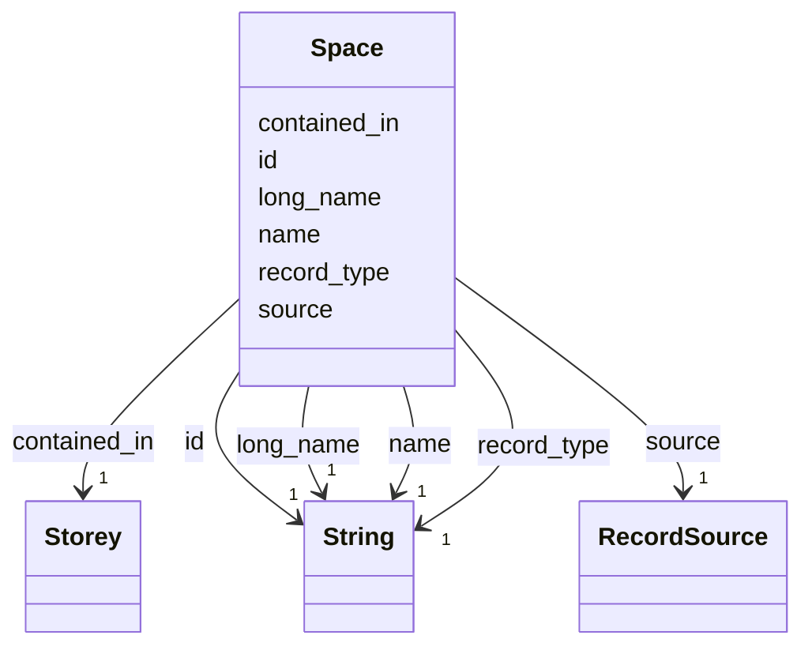

---
search:
  boost: 10.0
---

# Class: Space 


_A room, or the exterior region of one storey. Parsed from IfcSpace, or derived._


<div data-search-exclude markdown="1">


URI: [rcpc:Space](https://rcpc.for5672/schema/Space)





<!-- no inheritance hierarchy -->

## Slots

| Name | Cardinality and Range | Description | Inheritance |
| ---  | --- | --- | --- |
| [record_type](record_type.md) | 1 <br/> [xsd:string](http://www.w3.org/2001/XMLSchema#string) | Which class in this schema the record belongs to | direct |
| [id](id.md) | 1 <br/> [xsd:string](http://www.w3.org/2001/XMLSchema#string) | The IFC GlobalId in its 22-character form: the entity's own when parsed, mint... | direct |
| [name](name.md) | 1 <br/> [xsd:string](http://www.w3.org/2001/XMLSchema#string) | The IFC Name | direct |
| [long_name](long_name.md) | 1 <br/> [xsd:string](http://www.w3.org/2001/XMLSchema#string) | The IFC LongName of a Space or Storey | direct |
| [source](source.md) | 1 <br/> [RecordSource](RecordSource.md) | Where a component or Space came from: parsed from the IFC model, or produced ... | direct |
| [contained_in](contained_in.md) | 1 <br/> [Storey](Storey.md) | IFC's containment relation under its own name | direct |


## Usages

| used by | used in | type | used |
| ---  | --- | --- | --- |
| [BuildingComponent](BuildingComponent.md) | [located_in](located_in.md) | range | [Space](Space.md) |
| [Connector](Connector.md) | [connects](connects.md) | range | [Space](Space.md) |
| [Connector](Connector.md) | [located_in](located_in.md) | range | [Space](Space.md) |


## Identifier and Mapping Information


### Schema Source


* from schema: https://rcpc.for5672/schema/product


## Mappings

| Mapping Type | Mapped Value |
| ---  | ---  |
| self | rcpc:Space |
| native | rcpc:Space |


## LinkML Source

<!-- TODO: investigate https://stackoverflow.com/questions/37606292/how-to-create-tabbed-code-blocks-in-mkdocs-or-sphinx -->

### Direct

<details>
```yaml
name: Space
description: A room, or the exterior region of one storey. Parsed from IfcSpace, or
  derived.
from_schema: https://rcpc.for5672/schema/product
slots:
- record_type
- id
- name
- long_name
- source
- contained_in
slot_usage:
  id:
    name: id
    description: 'The IFC GlobalId in its 22-character form: the entity''s own when
      parsed, minted in the same format when derived.'
    pattern: ^[0-3][0-9A-Za-z_$]{21}$
  source:
    name: source
    required: true
  contained_in:
    name: contained_in
    required: true
    pattern: ^[0-3][0-9A-Za-z_$]{21}$

```
</details>

### Induced

<details>
```yaml
name: Space
description: A room, or the exterior region of one storey. Parsed from IfcSpace, or
  derived.
from_schema: https://rcpc.for5672/schema/product
slot_usage:
  id:
    name: id
    description: 'The IFC GlobalId in its 22-character form: the entity''s own when
      parsed, minted in the same format when derived.'
    pattern: ^[0-3][0-9A-Za-z_$]{21}$
  source:
    name: source
    required: true
  contained_in:
    name: contained_in
    required: true
    pattern: ^[0-3][0-9A-Za-z_$]{21}$
attributes:
  record_type:
    name: record_type
    description: Which class in this schema the record belongs to.
    from_schema: https://rcpc.for5672/schema/product
    designates_type: true
    owner: Space
    domain_of:
    - Storey
    - Space
    - BuildingComponent
    - Task
    range: string
    required: true
  id:
    name: id
    description: 'The IFC GlobalId in its 22-character form: the entity''s own when
      parsed, minted in the same format when derived.'
    from_schema: https://rcpc.for5672/schema/common
    identifier: true
    owner: Space
    domain_of:
    - CapabilityType
    - Storey
    - Space
    - BuildingComponent
    - RobotUnit
    - PhysicalProperty
    - Sensor
    - OperationalRequirement
    - Safety
    - Activity
    - Task
    range: string
    required: true
    pattern: ^[0-3][0-9A-Za-z_$]{21}$
  name:
    name: name
    description: The IFC Name. Empty when the IFC file has none.
    from_schema: https://rcpc.for5672/schema/product
    owner: Space
    domain_of:
    - Storey
    - Space
    - BuildingComponent
    range: string
    required: true
  long_name:
    name: long_name
    description: The IFC LongName of a Space or Storey. Empty when the IFC file has
      none.
    from_schema: https://rcpc.for5672/schema/product
    owner: Space
    domain_of:
    - Storey
    - Space
    range: string
    required: true
  source:
    name: source
    description: 'Where a component or Space came from: parsed from the IFC model,
      or produced by the derivation.'
    from_schema: https://rcpc.for5672/schema/product
    owner: Space
    domain_of:
    - Space
    - BuildingComponent
    range: RecordSource
    required: true
  contained_in:
    name: contained_in
    description: IFC's containment relation under its own name. On a BuildingComponent,
      its storey; on a Space, the storey that aggregates it or, for a derived Space,
      the storey it was cut for. Empty on a part, contained only through its assembly.
    from_schema: https://rcpc.for5672/schema/product
    owner: Space
    domain_of:
    - Space
    - BuildingComponent
    range: Storey
    required: true
    pattern: ^[0-3][0-9A-Za-z_$]{21}$

```
</details></div>