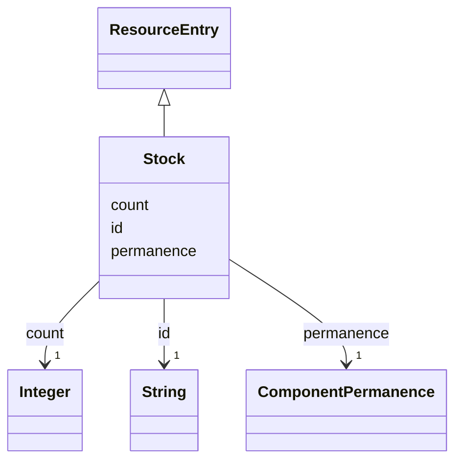

---
search:
  boost: 10.0
---

# Class: Stock 


_A stock a method uses one unit of, such as formwork panels or rebar._


<div data-search-exclude markdown="1">


URI: [rcpc:Stock](https://rcpc.for5672/schema/Stock)





## Inheritance
* [ResourceEntry](ResourceEntry.md)
    * **Stock**


## Slots

| Name | Cardinality and Range | Description | Inheritance |
| ---  | --- | --- | --- |
| [permanence](permanence.md) | 1 <br/> [ComponentPermanence](ComponentPermanence.md) | Whether a unit a method takes comes back when the method ends, or is consumed | direct |
| [id](id.md) | 1 <br/> [xsd:string](http://www.w3.org/2001/XMLSchema#string) | The stock's name, an HDDL name | [ResourceEntry](ResourceEntry.md) |
| [count](count.md) | 1 <br/> [xsd:integer](http://www.w3.org/2001/XMLSchema#integer) | How many identical units this entry stands for: machines of a robot product, ... | [ResourceEntry](ResourceEntry.md) |


## Identifier and Mapping Information


### Schema Source


* from schema: https://rcpc.for5672/schema/resource


## Mappings

| Mapping Type | Mapped Value |
| ---  | ---  |
| self | rcpc:Stock |
| native | rcpc:Stock |


## LinkML Source

<!-- TODO: investigate https://stackoverflow.com/questions/37606292/how-to-create-tabbed-code-blocks-in-mkdocs-or-sphinx -->

### Direct

<details>
```yaml
name: Stock
description: A stock a method uses one unit of, such as formwork panels or rebar.
from_schema: https://rcpc.for5672/schema/resource
is_a: ResourceEntry
slots:
- permanence
slot_usage:
  id:
    name: id
    description: The stock's name, an HDDL name.
    pattern: ^[A-Za-z][A-Za-z0-9_]*$
  permanence:
    name: permanence
    description: Whether a unit a method takes comes back when the method ends, or
      is consumed.
    required: true

```
</details>

### Induced

<details>
```yaml
name: Stock
description: A stock a method uses one unit of, such as formwork panels or rebar.
from_schema: https://rcpc.for5672/schema/resource
is_a: ResourceEntry
slot_usage:
  id:
    name: id
    description: The stock's name, an HDDL name.
    pattern: ^[A-Za-z][A-Za-z0-9_]*$
  permanence:
    name: permanence
    description: Whether a unit a method takes comes back when the method ends, or
      is consumed.
    required: true
attributes:
  permanence:
    name: permanence
    description: Whether a unit a method takes comes back when the method ends, or
      is consumed.
    from_schema: https://rcpc.for5672/schema/common
    owner: Stock
    domain_of:
    - BuildingComponent
    - Stock
    range: ComponentPermanence
    required: true
  id:
    name: id
    description: The stock's name, an HDDL name.
    from_schema: https://rcpc.for5672/schema/common
    identifier: true
    owner: Stock
    domain_of:
    - CapabilityType
    - MaterialCategory
    - Storey
    - Space
    - BuildingComponent
    - Material
    - ResourceEntry
    - PhysicalProperty
    - Sensor
    - OperationalRequirement
    - Safety
    - Activity
    - Task
    - Method
    - TaskNetwork
    - TaskInstance
    range: string
    required: true
    pattern: ^[A-Za-z][A-Za-z0-9_]*$
  count:
    name: count
    description: 'How many identical units this entry stands for: machines of a robot
      product, or units of a stock.'
    from_schema: https://rcpc.for5672/schema/resource
    owner: Stock
    domain_of:
    - ResourceEntry
    range: integer
    required: true
    minimum_value: 1

```
</details></div>