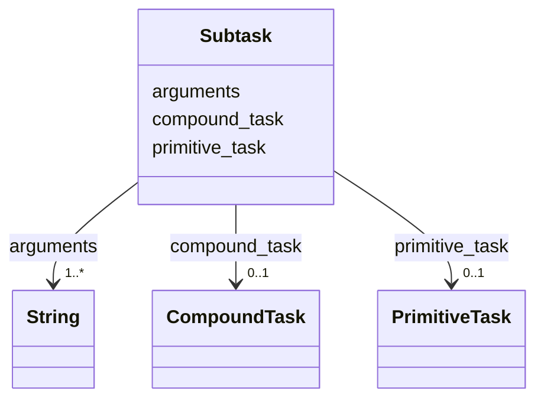

---
search:
  boost: 10.0
---

# Class: Subtask 


_One entry of a method's subtask list: the task it names and the arguments it passes, in that task's parameter order. Its position in the list, counted from 1, is what ordering refers to._


<div data-search-exclude markdown="1">


URI: [rcpc:Subtask](https://rcpc.for5672/schema/Subtask)





<!-- no inheritance hierarchy -->

## Slots

| Name | Cardinality and Range | Description | Inheritance |
| ---  | --- | --- | --- |
| [primitive_task](primitive_task.md) | 0..1 <br/> [PrimitiveTask](PrimitiveTask.md) | The primitive task a subtask names or an instance realises | direct |
| [compound_task](compound_task.md) | 0..1 <br/> [CompoundTask](CompoundTask.md) | The compound task a method decomposes, a subtask names, or an instance realis... | direct |
| [arguments](arguments.md) | 1..* <br/> [xsd:string](http://www.w3.org/2001/XMLSchema#string) | The values a subtask passes, in the named task's parameter order: method para... | direct |


## Usages

| used by | used in | type | used |
| ---  | --- | --- | --- |
| [Method](Method.md) | [subtasks](subtasks.md) | range | [Subtask](Subtask.md) |


## Rules


### 

| Rule Applied | Preconditions | Postconditions | Elseconditions |
|--------------|---------------|----------------|----------------|
| slot_conditions |```{'arguments': {'required': True}}``` | | |


## Identifier and Mapping Information


### Schema Source


* from schema: https://rcpc.for5672/schema/process


## Mappings

| Mapping Type | Mapped Value |
| ---  | ---  |
| self | rcpc:Subtask |
| native | rcpc:Subtask |


## LinkML Source

<!-- TODO: investigate https://stackoverflow.com/questions/37606292/how-to-create-tabbed-code-blocks-in-mkdocs-or-sphinx -->

### Direct

<details>
```yaml
name: Subtask
description: 'One entry of a method''s subtask list: the task it names and the arguments
  it passes, in that task''s parameter order. Its position in the list, counted from
  1, is what ordering refers to.'
from_schema: https://rcpc.for5672/schema/process
slots:
- primitive_task
- compound_task
- arguments
slot_usage:
  arguments:
    name: arguments
    required: true
rules:
- preconditions:
    slot_conditions:
      arguments:
        name: arguments
        required: true
  postconditions:
    exactly_one_of:
    - slot_conditions:
        primitive_task:
          name: primitive_task
          required: true
    - slot_conditions:
        compound_task:
          name: compound_task
          required: true
  description: A subtask names exactly one task, primitive or compound.

```
</details>

### Induced

<details>
```yaml
name: Subtask
description: 'One entry of a method''s subtask list: the task it names and the arguments
  it passes, in that task''s parameter order. Its position in the list, counted from
  1, is what ordering refers to.'
from_schema: https://rcpc.for5672/schema/process
slot_usage:
  arguments:
    name: arguments
    required: true
attributes:
  primitive_task:
    name: primitive_task
    description: The primitive task a subtask names or an instance realises.
    from_schema: https://rcpc.for5672/schema/process
    rank: 1000
    owner: Subtask
    domain_of:
    - Subtask
    range: PrimitiveTask
  compound_task:
    name: compound_task
    description: The compound task a method decomposes, a subtask names, or an instance
      realises.
    from_schema: https://rcpc.for5672/schema/process
    rank: 1000
    owner: Subtask
    domain_of:
    - Method
    - Subtask
    range: CompoundTask
  arguments:
    name: arguments
    description: 'The values a subtask passes, in the named task''s parameter order:
      method parameter names or object ids.'
    from_schema: https://rcpc.for5672/schema/process
    rank: 1000
    owner: Subtask
    domain_of:
    - Subtask
    range: string
    required: true
    multivalued: true
rules:
- preconditions:
    slot_conditions:
      arguments:
        name: arguments
        required: true
  postconditions:
    exactly_one_of:
    - slot_conditions:
        primitive_task:
          name: primitive_task
          required: true
    - slot_conditions:
        compound_task:
          name: compound_task
          required: true
  description: A subtask names exactly one task, primitive or compound.

```
</details></div>