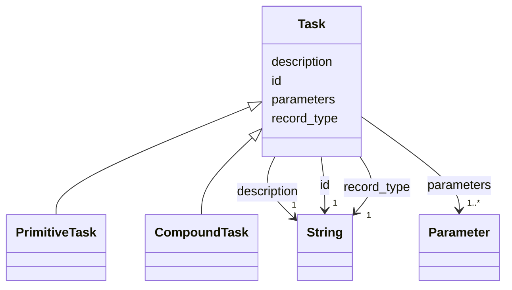

---
search:
  boost: 10.0
---

# Class: Task 


_HDDL's task: a name and typed parameters, before it is said whether the task is primitive or compound. The base of PrimitiveTask and CompoundTask; never written as a record._


<div data-search-exclude markdown="1">


URI: [rcpc:Task](https://rcpc.for5672/schema/Task)





## Inheritance
* **Task**
    * [PrimitiveTask](PrimitiveTask.md)
    * [CompoundTask](CompoundTask.md)


## Slots

| Name | Cardinality and Range | Description | Inheritance |
| ---  | --- | --- | --- |
| [record_type](record_type.md) | 1 <br/> [xsd:string](http://www.w3.org/2001/XMLSchema#string) | Which class in this schema the record belongs to | direct |
| [id](id.md) | 1 <br/> [xsd:string](http://www.w3.org/2001/XMLSchema#string) | The task name, unique among the tasks and methods of the catalogue | direct |
| [description](description.md) | 1 <br/> [xsd:string](http://www.w3.org/2001/XMLSchema#string) | What this is, in one or two plain sentences | direct |
| [parameters](parameters.md) | 1..* <br/> [Parameter](Parameter.md) | The declared parameters, keyed by name | direct |


## Identifier and Mapping Information


### Schema Source


* from schema: https://rcpc.for5672/schema/process


## Mappings

| Mapping Type | Mapped Value |
| ---  | ---  |
| self | rcpc:Task |
| native | rcpc:Task |


## LinkML Source

<!-- TODO: investigate https://stackoverflow.com/questions/37606292/how-to-create-tabbed-code-blocks-in-mkdocs-or-sphinx -->

### Direct

<details>
```yaml
name: Task
description: 'HDDL''s task: a name and typed parameters, before it is said whether
  the task is primitive or compound. The base of PrimitiveTask and CompoundTask; never
  written as a record.'
from_schema: https://rcpc.for5672/schema/process
slots:
- record_type
- id
- description
- parameters
slot_usage:
  id:
    name: id
    description: The task name, unique among the tasks and methods of the catalogue.
    pattern: ^[A-Za-z][A-Za-z0-9_]*$
  description:
    name: description
    required: true
  parameters:
    name: parameters
    required: true

```
</details>

### Induced

<details>
```yaml
name: Task
description: 'HDDL''s task: a name and typed parameters, before it is said whether
  the task is primitive or compound. The base of PrimitiveTask and CompoundTask; never
  written as a record.'
from_schema: https://rcpc.for5672/schema/process
slot_usage:
  id:
    name: id
    description: The task name, unique among the tasks and methods of the catalogue.
    pattern: ^[A-Za-z][A-Za-z0-9_]*$
  description:
    name: description
    required: true
  parameters:
    name: parameters
    required: true
attributes:
  record_type:
    name: record_type
    description: Which class in this schema the record belongs to.
    from_schema: https://rcpc.for5672/schema/product
    designates_type: true
    owner: Task
    domain_of:
    - Storey
    - Space
    - BuildingComponent
    - Task
    range: string
    required: true
  id:
    name: id
    description: The task name, unique among the tasks and methods of the catalogue.
    from_schema: https://rcpc.for5672/schema/common
    identifier: true
    owner: Task
    domain_of:
    - CapabilityType
    - Storey
    - Space
    - BuildingComponent
    - RobotUnit
    - PhysicalProperty
    - Sensor
    - OperationalRequirement
    - Safety
    - Activity
    - Task
    range: string
    required: true
    pattern: ^[A-Za-z][A-Za-z0-9_]*$
  description:
    name: description
    description: What this is, in one or two plain sentences.
    from_schema: https://rcpc.for5672/schema/common
    owner: Task
    domain_of:
    - CapabilityType
    - Task
    range: string
    required: true
  parameters:
    name: parameters
    description: The declared parameters, keyed by name.
    from_schema: https://rcpc.for5672/schema/process
    rank: 1000
    owner: Task
    domain_of:
    - Task
    range: Parameter
    required: true
    multivalued: true
    inlined: true

```
</details></div>