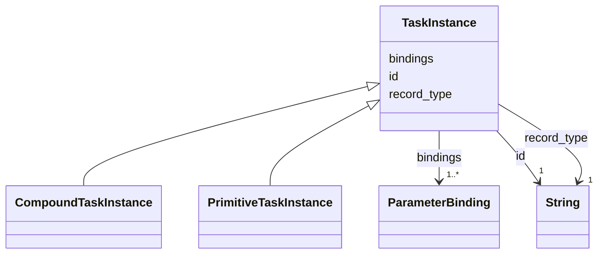

---
search:
  boost: 10.0
---

# Class: TaskInstance 


_One planned occurrence of a task, before it is said whether the task is primitive or compound. The base of CompoundTaskInstance and PrimitiveTaskInstance and the range a compound instance's subtasks share; never written as a record._


<div data-search-exclude markdown="1">


URI: [rcpc:TaskInstance](https://rcpc.for5672/schema/TaskInstance)





## Inheritance
* **TaskInstance**
    * [CompoundTaskInstance](CompoundTaskInstance.md)
    * [PrimitiveTaskInstance](PrimitiveTaskInstance.md)


## Slots

| Name | Cardinality and Range | Description | Inheritance |
| ---  | --- | --- | --- |
| [record_type](record_type.md) | 1 <br/> [xsd:string](http://www.w3.org/2001/XMLSchema#string) | Which class in this schema the record belongs to | direct |
| [id](id.md) | 1 <br/> [xsd:string](http://www.w3.org/2001/XMLSchema#string) | The instance's id, unique within the plan | direct |
| [bindings](bindings.md) | 1..* <br/> [ParameterBinding](ParameterBinding.md) | The instance's parameters bound to object ids, keyed by parameter name | direct |


## Usages

| used by | used in | type | used |
| ---  | --- | --- | --- |
| [CompoundTaskInstance](CompoundTaskInstance.md) | [subtasks](subtasks.md) | range | [TaskInstance](TaskInstance.md) |


## Identifier and Mapping Information


### Schema Source


* from schema: https://rcpc.for5672/schema/process


## Mappings

| Mapping Type | Mapped Value |
| ---  | ---  |
| self | rcpc:TaskInstance |
| native | rcpc:TaskInstance |


## LinkML Source

<!-- TODO: investigate https://stackoverflow.com/questions/37606292/how-to-create-tabbed-code-blocks-in-mkdocs-or-sphinx -->

### Direct

<details>
```yaml
name: TaskInstance
description: One planned occurrence of a task, before it is said whether the task
  is primitive or compound. The base of CompoundTaskInstance and PrimitiveTaskInstance
  and the range a compound instance's subtasks share; never written as a record.
from_schema: https://rcpc.for5672/schema/process
slots:
- record_type
- id
- bindings
slot_usage:
  id:
    name: id
    description: The instance's id, unique within the plan.
  bindings:
    name: bindings
    required: true

```
</details>

### Induced

<details>
```yaml
name: TaskInstance
description: One planned occurrence of a task, before it is said whether the task
  is primitive or compound. The base of CompoundTaskInstance and PrimitiveTaskInstance
  and the range a compound instance's subtasks share; never written as a record.
from_schema: https://rcpc.for5672/schema/process
slot_usage:
  id:
    name: id
    description: The instance's id, unique within the plan.
  bindings:
    name: bindings
    required: true
attributes:
  record_type:
    name: record_type
    description: Which class in this schema the record belongs to.
    from_schema: https://rcpc.for5672/schema/product
    designates_type: true
    owner: TaskInstance
    domain_of:
    - Storey
    - Space
    - BuildingComponent
    - Material
    - Task
    - Method
    - TaskNetwork
    - TaskInstance
    range: string
    required: true
  id:
    name: id
    description: The instance's id, unique within the plan.
    from_schema: https://rcpc.for5672/schema/common
    identifier: true
    owner: TaskInstance
    domain_of:
    - CapabilityType
    - MaterialCategory
    - Storey
    - Space
    - BuildingComponent
    - Material
    - ResourceEntry
    - PhysicalProperty
    - Sensor
    - OperationalRequirement
    - Safety
    - Activity
    - Task
    - Method
    - TaskNetwork
    - TaskInstance
    range: string
    required: true
  bindings:
    name: bindings
    description: The instance's parameters bound to object ids, keyed by parameter
      name.
    from_schema: https://rcpc.for5672/schema/process
    rank: 1000
    owner: TaskInstance
    domain_of:
    - TaskInstance
    range: ParameterBinding
    required: true
    multivalued: true
    inlined: true

```
</details></div>