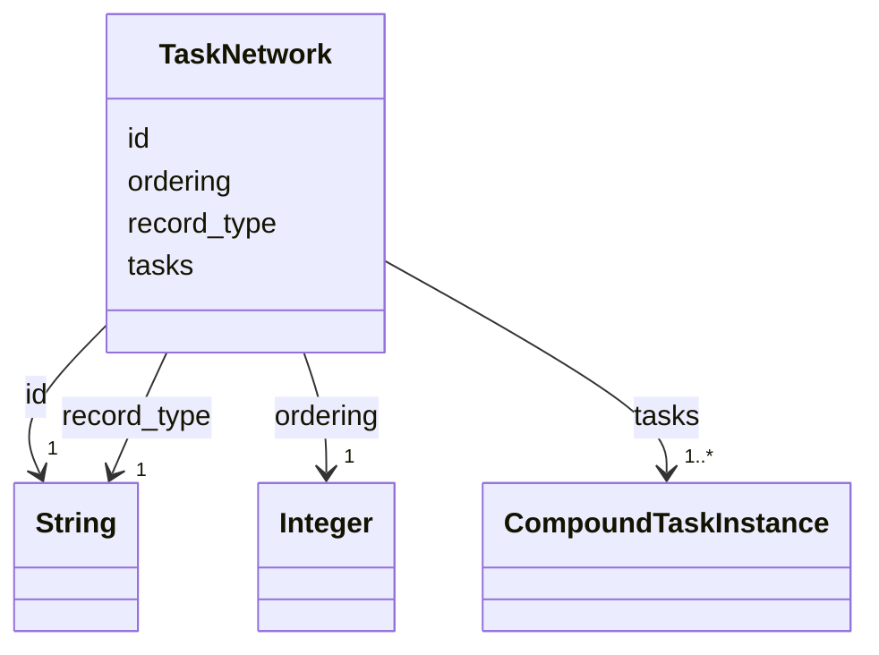

---
search:
  boost: 10.0
---

# Class: TaskNetwork 


_HDDL's initial task network: what the plan is asked to accomplish, the compound task instances no compound lists as a subtask, in list order, with the ordering among them._


<div data-search-exclude markdown="1">


URI: [rcpc:TaskNetwork](https://rcpc.for5672/schema/TaskNetwork)





<!-- no inheritance hierarchy -->

## Slots

| Name | Cardinality and Range | Description | Inheritance |
| ---  | --- | --- | --- |
| [record_type](record_type.md) | 1 <br/> [xsd:string](http://www.w3.org/2001/XMLSchema#string) | Which class in this schema the record belongs to | direct |
| [id](id.md) | 1 <br/> [xsd:string](http://www.w3.org/2001/XMLSchema#string) | The network's name | direct |
| [tasks](tasks.md) | 1..* <br/> [CompoundTaskInstance](CompoundTaskInstance.md) | The network's tasks in list order, counted from 1, each position its label | direct |
| [ordering](ordering.md) | 1 <br/> [xsd:integer](http://www.w3.org/2001/XMLSchema#integer) | Pairs of positions in the owner's subtask or task list; in each pair the firs... | direct |


## Identifier and Mapping Information


### Schema Source


* from schema: https://rcpc.for5672/schema/process


## Mappings

| Mapping Type | Mapped Value |
| ---  | ---  |
| self | rcpc:TaskNetwork |
| native | rcpc:TaskNetwork |


## LinkML Source

<!-- TODO: investigate https://stackoverflow.com/questions/37606292/how-to-create-tabbed-code-blocks-in-mkdocs-or-sphinx -->

### Direct

<details>
```yaml
name: TaskNetwork
description: 'HDDL''s initial task network: what the plan is asked to accomplish,
  the compound task instances no compound lists as a subtask, in list order, with
  the ordering among them.'
from_schema: https://rcpc.for5672/schema/process
slots:
- record_type
- id
- tasks
- ordering
slot_usage:
  id:
    name: id
    description: The network's name.
    pattern: ^[A-Za-z][A-Za-z0-9_]*$
  tasks:
    name: tasks
    required: true
  ordering:
    name: ordering
    required: true

```
</details>

### Induced

<details>
```yaml
name: TaskNetwork
description: 'HDDL''s initial task network: what the plan is asked to accomplish,
  the compound task instances no compound lists as a subtask, in list order, with
  the ordering among them.'
from_schema: https://rcpc.for5672/schema/process
slot_usage:
  id:
    name: id
    description: The network's name.
    pattern: ^[A-Za-z][A-Za-z0-9_]*$
  tasks:
    name: tasks
    required: true
  ordering:
    name: ordering
    required: true
attributes:
  record_type:
    name: record_type
    description: Which class in this schema the record belongs to.
    from_schema: https://rcpc.for5672/schema/product
    designates_type: true
    owner: TaskNetwork
    domain_of:
    - Storey
    - Space
    - BuildingComponent
    - Material
    - Task
    - Method
    - TaskNetwork
    - TaskInstance
    range: string
    required: true
  id:
    name: id
    description: The network's name.
    from_schema: https://rcpc.for5672/schema/common
    identifier: true
    owner: TaskNetwork
    domain_of:
    - CapabilityType
    - MaterialCategory
    - Storey
    - Space
    - BuildingComponent
    - Material
    - ResourceEntry
    - PhysicalProperty
    - Sensor
    - OperationalRequirement
    - Safety
    - Activity
    - Task
    - Method
    - TaskNetwork
    - TaskInstance
    range: string
    required: true
    pattern: ^[A-Za-z][A-Za-z0-9_]*$
  tasks:
    name: tasks
    description: The network's tasks in list order, counted from 1, each position
      its label.
    from_schema: https://rcpc.for5672/schema/process
    rank: 1000
    owner: TaskNetwork
    domain_of:
    - TaskNetwork
    range: CompoundTaskInstance
    required: true
    multivalued: true
    minimum_cardinality: 1
  ordering:
    name: ordering
    description: Pairs of positions in the owner's subtask or task list; in each pair
      the first ends before the second starts. Empty when unordered.
    from_schema: https://rcpc.for5672/schema/process
    rank: 1000
    owner: TaskNetwork
    domain_of:
    - Method
    - TaskNetwork
    range: integer
    required: true
    array:
      exact_number_dimensions: 2
      dimensions:
      - alias: pair
      - exact_cardinality: 2

```
</details></div>