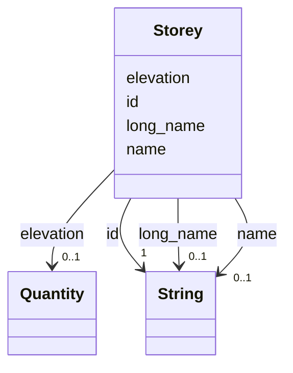

---
search:
  boost: 10.0
---

# Class: Storey 


_A building storey._


<div data-search-exclude markdown="1">


URI: [rcpc:Storey](https://rcpc.for5672/schema/Storey)





<!-- no inheritance hierarchy -->

## Slots

| Name | Cardinality and Range | Description | Inheritance |
| ---  | --- | --- | --- |
| [id](id.md) | 1 <br/> [xsd:string](http://www.w3.org/2001/XMLSchema#string) | The IFC GlobalId in its 22-character form: the entity's own when parsed, mint... | direct |
| [name](name.md) | 0..1 <br/> [xsd:string](http://www.w3.org/2001/XMLSchema#string) | The IFC Name | direct |
| [long_name](long_name.md) | 0..1 <br/> [xsd:string](http://www.w3.org/2001/XMLSchema#string) | The IFC LongName of a Space or Storey | direct |
| [elevation](elevation.md) | 0..1 <br/> [Quantity](Quantity.md) | The storey's level in the project frame | direct |


## Usages

| used by | used in | type | used |
| ---  | --- | --- | --- |
| [Space](Space.md) | [contained_in](contained_in.md) | range | [Storey](Storey.md) |


## Identifier and Mapping Information


### Schema Source


* from schema: https://rcpc.for5672/schema/product


## Mappings

| Mapping Type | Mapped Value |
| ---  | ---  |
| self | rcpc:Storey |
| native | rcpc:Storey |


## LinkML Source

<!-- TODO: investigate https://stackoverflow.com/questions/37606292/how-to-create-tabbed-code-blocks-in-mkdocs-or-sphinx -->

### Direct

<details>
```yaml
name: Storey
description: A building storey.
from_schema: https://rcpc.for5672/schema/product
slots:
- id
- name
- long_name
- elevation
slot_usage:
  id:
    name: id
    description: 'The IFC GlobalId in its 22-character form: the entity''s own when
      parsed, minted in the same format when derived.'
    pattern: ^[0-3][0-9A-Za-z_$]{21}$

```
</details>

### Induced

<details>
```yaml
name: Storey
description: A building storey.
from_schema: https://rcpc.for5672/schema/product
slot_usage:
  id:
    name: id
    description: 'The IFC GlobalId in its 22-character form: the entity''s own when
      parsed, minted in the same format when derived.'
    pattern: ^[0-3][0-9A-Za-z_$]{21}$
attributes:
  id:
    name: id
    description: 'The IFC GlobalId in its 22-character form: the entity''s own when
      parsed, minted in the same format when derived.'
    from_schema: https://rcpc.for5672/schema/common
    identifier: true
    owner: Storey
    domain_of:
    - CapabilityType
    - Storey
    - Space
    range: string
    required: true
    pattern: ^[0-3][0-9A-Za-z_$]{21}$
  name:
    name: name
    description: The IFC Name.
    from_schema: https://rcpc.for5672/schema/product
    rank: 1000
    owner: Storey
    domain_of:
    - Storey
    - Space
    range: string
  long_name:
    name: long_name
    description: The IFC LongName of a Space or Storey.
    from_schema: https://rcpc.for5672/schema/product
    rank: 1000
    owner: Storey
    domain_of:
    - Storey
    - Space
    range: string
  elevation:
    name: elevation
    description: The storey's level in the project frame.
    from_schema: https://rcpc.for5672/schema/product
    rank: 1000
    owner: Storey
    domain_of:
    - Storey
    range: Quantity
    inlined: true

```
</details></div>