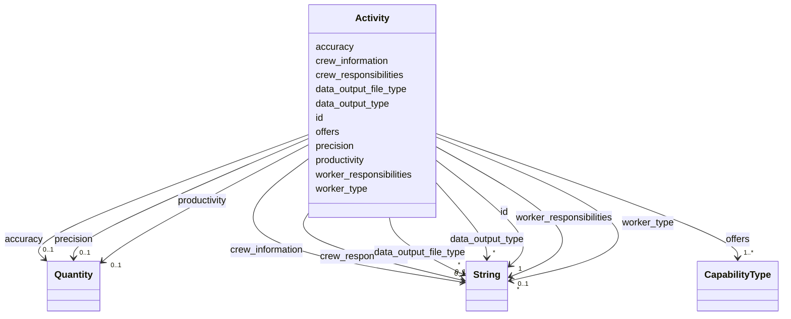

---
search:
  boost: 10.0
---

# Class: Activity 


_CRS group 4: the capabilities a robot offers and how it performs them. The one required group, because offers is required._


<div data-search-exclude markdown="1">


URI: [rcpc:Activity](https://rcpc.for5672/schema/Activity)





<!-- no inheritance hierarchy -->

## Slots

| Name | Cardinality and Range | Description | Inheritance |
| ---  | --- | --- | --- |
| [id](id.md) | 1 <br/> [xsd:string](http://www.w3.org/2001/XMLSchema#string) | Identifier, unique among instances of its class | direct |
| [offers](offers.md) | 1..* <br/> [CapabilityType](CapabilityType.md) | The capability types this robot offers | direct |
| [productivity](productivity.md) | 0..1 <br/> [Quantity](Quantity.md) | How much work the robot does per unit of time, in a unit that fits the activi... | direct |
| [precision](precision.md) | 0..1 <br/> [Quantity](Quantity.md) | How finely the robot repeats its work, recommended in millimetres | direct |
| [accuracy](accuracy.md) | 0..1 <br/> [Quantity](Quantity.md) | How close the robot's work comes to the target, recommended in millimetres | direct |
| [data_output_type](data_output_type.md) | * <br/> [xsd:string](http://www.w3.org/2001/XMLSchema#string) | The forms of data the robot's sensors output | direct |
| [data_output_file_type](data_output_file_type.md) | * <br/> [xsd:string](http://www.w3.org/2001/XMLSchema#string) | The file formats of the data the robot's sensors output | direct |
| [crew_information](crew_information.md) | 0..1 <br/> [xsd:string](http://www.w3.org/2001/XMLSchema#string) | The composition of the team working with the robot | direct |
| [crew_responsibilities](crew_responsibilities.md) | 0..1 <br/> [xsd:string](http://www.w3.org/2001/XMLSchema#string) | What the crew does while the robot performs its tasks | direct |
| [worker_type](worker_type.md) | * <br/> [xsd:string](http://www.w3.org/2001/XMLSchema#string) | The kinds of worker who work with the robot | direct |
| [worker_responsibilities](worker_responsibilities.md) | 0..1 <br/> [xsd:string](http://www.w3.org/2001/XMLSchema#string) | What the workers do while the robot performs its tasks | direct |


## Usages

| used by | used in | type | used |
| ---  | --- | --- | --- |
| [RobotUnit](RobotUnit.md) | [activity_group](activity_group.md) | range | [Activity](Activity.md) |


## Identifier and Mapping Information


### Schema Source


* from schema: https://rcpc.for5672/schema/resource


## Mappings

| Mapping Type | Mapped Value |
| ---  | ---  |
| self | rcpc:Activity |
| native | rcpc:Activity |


## LinkML Source

<!-- TODO: investigate https://stackoverflow.com/questions/37606292/how-to-create-tabbed-code-blocks-in-mkdocs-or-sphinx -->

### Direct

<details>
```yaml
name: Activity
description: 'CRS group 4: the capabilities a robot offers and how it performs them.
  The one required group, because offers is required.'
from_schema: https://rcpc.for5672/schema/resource
slots:
- id
- offers
- productivity
- precision
- accuracy
- data_output_type
- data_output_file_type
- crew_information
- crew_responsibilities
- worker_type
- worker_responsibilities

```
</details>

### Induced

<details>
```yaml
name: Activity
description: 'CRS group 4: the capabilities a robot offers and how it performs them.
  The one required group, because offers is required.'
from_schema: https://rcpc.for5672/schema/resource
attributes:
  id:
    name: id
    description: Identifier, unique among instances of its class.
    from_schema: https://rcpc.for5672/schema/common
    identifier: true
    owner: Activity
    domain_of:
    - CapabilityType
    - MaterialCategory
    - RobotUnit
    - PhysicalProperty
    - Sensor
    - OperationalRequirement
    - Safety
    - Activity
    range: string
    required: true
  offers:
    name: offers
    description: The capability types this robot offers. The CRS Task Type.
    from_schema: https://rcpc.for5672/schema/resource
    rank: 1000
    owner: Activity
    domain_of:
    - Activity
    range: CapabilityType
    required: true
    multivalued: true
  productivity:
    name: productivity
    description: How much work the robot does per unit of time, in a unit that fits
      the activity, for example brick/h. The CRS Productivity with its Productivity
      Units.
    from_schema: https://rcpc.for5672/schema/resource
    rank: 1000
    owner: Activity
    domain_of:
    - Activity
    range: Quantity
    inlined: true
  precision:
    name: precision
    description: How finely the robot repeats its work, recommended in millimetres.
      The CRS Precision with its Precision Units.
    from_schema: https://rcpc.for5672/schema/resource
    rank: 1000
    owner: Activity
    domain_of:
    - Activity
    range: Quantity
    inlined: true
  accuracy:
    name: accuracy
    description: How close the robot's work comes to the target, recommended in millimetres.
      The CRS Accuracy with its Accuracy Units.
    from_schema: https://rcpc.for5672/schema/resource
    rank: 1000
    owner: Activity
    domain_of:
    - Activity
    range: Quantity
    inlined: true
  data_output_type:
    name: data_output_type
    description: The forms of data the robot's sensors output.
    from_schema: https://rcpc.for5672/schema/resource
    rank: 1000
    owner: Activity
    domain_of:
    - Activity
    range: string
    multivalued: true
  data_output_file_type:
    name: data_output_file_type
    description: The file formats of the data the robot's sensors output.
    from_schema: https://rcpc.for5672/schema/resource
    rank: 1000
    owner: Activity
    domain_of:
    - Activity
    range: string
    multivalued: true
  crew_information:
    name: crew_information
    description: The composition of the team working with the robot.
    from_schema: https://rcpc.for5672/schema/resource
    rank: 1000
    owner: Activity
    domain_of:
    - Activity
    range: string
  crew_responsibilities:
    name: crew_responsibilities
    description: What the crew does while the robot performs its tasks.
    from_schema: https://rcpc.for5672/schema/resource
    rank: 1000
    owner: Activity
    domain_of:
    - Activity
    range: string
  worker_type:
    name: worker_type
    description: The kinds of worker who work with the robot.
    from_schema: https://rcpc.for5672/schema/resource
    rank: 1000
    owner: Activity
    domain_of:
    - Activity
    range: string
    multivalued: true
  worker_responsibilities:
    name: worker_responsibilities
    description: What the workers do while the robot performs its tasks.
    from_schema: https://rcpc.for5672/schema/resource
    rank: 1000
    owner: Activity
    domain_of:
    - Activity
    range: string

```
</details></div>