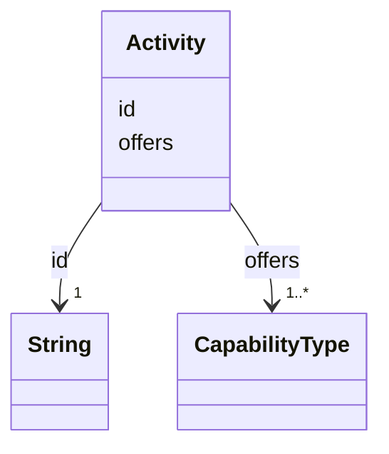

---
search:
  boost: 10.0
---

# Class: Activity 


_CRS group 4: the capabilities a robot offers and how it performs them. The one required group, because offers is required._


<div data-search-exclude markdown="1">


URI: [rcpc:Activity](https://rcpc.for5672/schema/Activity)





<!-- no inheritance hierarchy -->

## Slots

| Name | Cardinality and Range | Description | Inheritance |
| ---  | --- | --- | --- |
| [id](id.md) | 1 <br/> [xsd:string](http://www.w3.org/2001/XMLSchema#string) | Identifier, unique among instances of its class | direct |
| [offers](offers.md) | 1..* <br/> [CapabilityType](CapabilityType.md) | The capability types this robot offers | direct |


## Usages

| used by | used in | type | used |
| ---  | --- | --- | --- |
| [RobotUnit](RobotUnit.md) | [activity_group](activity_group.md) | range | [Activity](Activity.md) |


## Identifier and Mapping Information


### Schema Source


* from schema: https://rcpc.for5672/schema/resource


## Mappings

| Mapping Type | Mapped Value |
| ---  | ---  |
| self | rcpc:Activity |
| native | rcpc:Activity |


## LinkML Source

<!-- TODO: investigate https://stackoverflow.com/questions/37606292/how-to-create-tabbed-code-blocks-in-mkdocs-or-sphinx -->

### Direct

<details>
```yaml
name: Activity
description: 'CRS group 4: the capabilities a robot offers and how it performs them.
  The one required group, because offers is required.'
from_schema: https://rcpc.for5672/schema/resource
slots:
- id
- offers

```
</details>

### Induced

<details>
```yaml
name: Activity
description: 'CRS group 4: the capabilities a robot offers and how it performs them.
  The one required group, because offers is required.'
from_schema: https://rcpc.for5672/schema/resource
attributes:
  id:
    name: id
    description: Identifier, unique among instances of its class.
    from_schema: https://rcpc.for5672/schema/common
    identifier: true
    owner: Activity
    domain_of:
    - CapabilityType
    - RobotUnit
    - Activity
    range: string
    required: true
  offers:
    name: offers
    description: The capability types this robot offers. The CRS Task Type.
    from_schema: https://rcpc.for5672/schema/resource
    rank: 1000
    owner: Activity
    domain_of:
    - Activity
    range: CapabilityType
    required: true
    multivalued: true

```
</details></div>