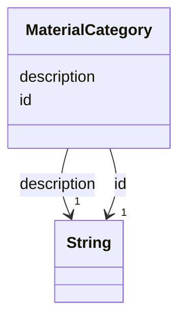

---
search:
  boost: 10.0
---

# Class: MaterialCategory 


_A category of material a construction method is written for, IFC's IfcMaterial.Category as this project's vocabulary. Named by a product Material's category and by a method's applies_to._


<div data-search-exclude markdown="1">


URI: [rcpc:MaterialCategory](https://rcpc.for5672/schema/MaterialCategory)





<!-- no inheritance hierarchy -->

## Slots

| Name | Cardinality and Range | Description | Inheritance |
| ---  | --- | --- | --- |
| [id](id.md) | 1 <br/> [xsd:string](http://www.w3.org/2001/XMLSchema#string) | Identifier, unique among instances of its class | direct |
| [description](description.md) | 1 <br/> [xsd:string](http://www.w3.org/2001/XMLSchema#string) | What this is, in one or two plain sentences | direct |


## Identifier and Mapping Information


### Schema Source


* from schema: https://rcpc.for5672/schema/common


## Mappings

| Mapping Type | Mapped Value |
| ---  | ---  |
| self | rcpc:MaterialCategory |
| native | rcpc:MaterialCategory |


## LinkML Source

<!-- TODO: investigate https://stackoverflow.com/questions/37606292/how-to-create-tabbed-code-blocks-in-mkdocs-or-sphinx -->

### Direct

<details>
```yaml
name: MaterialCategory
description: A category of material a construction method is written for, IFC's IfcMaterial.Category
  as this project's vocabulary. Named by a product Material's category and by a method's
  applies_to.
from_schema: https://rcpc.for5672/schema/common
slots:
- id
- description
slot_usage:
  description:
    name: description
    required: true

```
</details>

### Induced

<details>
```yaml
name: MaterialCategory
description: A category of material a construction method is written for, IFC's IfcMaterial.Category
  as this project's vocabulary. Named by a product Material's category and by a method's
  applies_to.
from_schema: https://rcpc.for5672/schema/common
slot_usage:
  description:
    name: description
    required: true
attributes:
  id:
    name: id
    description: Identifier, unique among instances of its class.
    from_schema: https://rcpc.for5672/schema/common
    identifier: true
    owner: MaterialCategory
    domain_of:
    - CapabilityType
    - MaterialCategory
    - RobotUnit
    - PhysicalProperty
    - Sensor
    - OperationalRequirement
    - Safety
    - Activity
    range: string
    required: true
  description:
    name: description
    description: What this is, in one or two plain sentences.
    from_schema: https://rcpc.for5672/schema/common
    owner: MaterialCategory
    domain_of:
    - CapabilityType
    - MaterialCategory
    range: string
    required: true

```
</details></div>