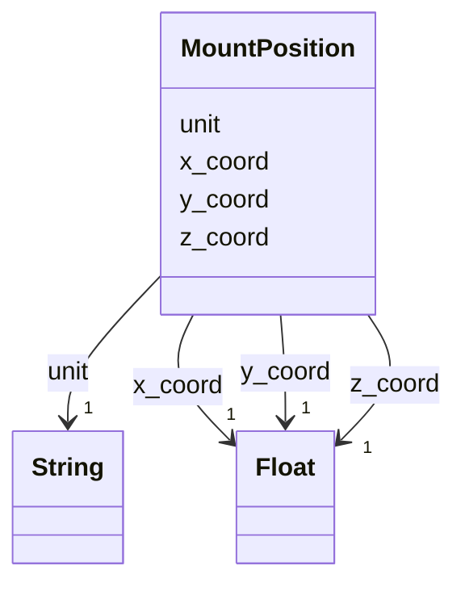

---
search:
  boost: 10.0
---

# Class: MountPosition 


_A point in the robot's own frame, with a unit. Distinct from common's Position, which is the project frame and has no unit._


<div data-search-exclude markdown="1">


URI: [rcpc:MountPosition](https://rcpc.for5672/schema/MountPosition)





<!-- no inheritance hierarchy -->

## Slots

| Name | Cardinality and Range | Description | Inheritance |
| ---  | --- | --- | --- |
| [x_coord](x_coord.md) | 1 <br/> [xsd:float](http://www.w3.org/2001/XMLSchema#float) | Cartesian x coordinate | direct |
| [y_coord](y_coord.md) | 1 <br/> [xsd:float](http://www.w3.org/2001/XMLSchema#float) | Cartesian y coordinate | direct |
| [z_coord](z_coord.md) | 1 <br/> [xsd:float](http://www.w3.org/2001/XMLSchema#float) | Cartesian z coordinate | direct |
| [unit](unit.md) | 1 <br/> [xsd:string](http://www.w3.org/2001/XMLSchema#string) | The unit of the value, or of the coordinates | direct |


## Usages

| used by | used in | type | used |
| ---  | --- | --- | --- |
| [PhysicalProperty](PhysicalProperty.md) | [manipulator_position](manipulator_position.md) | range | [MountPosition](MountPosition.md) |
| [Sensor](Sensor.md) | [sensor_mount_position](sensor_mount_position.md) | range | [MountPosition](MountPosition.md) |


## Identifier and Mapping Information


### Schema Source


* from schema: https://rcpc.for5672/schema/resource


## Mappings

| Mapping Type | Mapped Value |
| ---  | ---  |
| self | rcpc:MountPosition |
| native | rcpc:MountPosition |


## LinkML Source

<!-- TODO: investigate https://stackoverflow.com/questions/37606292/how-to-create-tabbed-code-blocks-in-mkdocs-or-sphinx -->

### Direct

<details>
```yaml
name: MountPosition
description: A point in the robot's own frame, with a unit. Distinct from common's
  Position, which is the project frame and has no unit.
from_schema: https://rcpc.for5672/schema/resource
slots:
- x_coord
- y_coord
- z_coord
- unit
slot_usage:
  x_coord:
    name: x_coord
    required: true
  y_coord:
    name: y_coord
    required: true
  z_coord:
    name: z_coord
    required: true
  unit:
    name: unit
    required: true

```
</details>

### Induced

<details>
```yaml
name: MountPosition
description: A point in the robot's own frame, with a unit. Distinct from common's
  Position, which is the project frame and has no unit.
from_schema: https://rcpc.for5672/schema/resource
slot_usage:
  x_coord:
    name: x_coord
    required: true
  y_coord:
    name: y_coord
    required: true
  z_coord:
    name: z_coord
    required: true
  unit:
    name: unit
    required: true
attributes:
  x_coord:
    name: x_coord
    description: Cartesian x coordinate.
    from_schema: https://rcpc.for5672/schema/common
    owner: MountPosition
    domain_of:
    - Position
    - MountPosition
    range: float
    required: true
  y_coord:
    name: y_coord
    description: Cartesian y coordinate.
    from_schema: https://rcpc.for5672/schema/common
    owner: MountPosition
    domain_of:
    - Position
    - MountPosition
    range: float
    required: true
  z_coord:
    name: z_coord
    description: Cartesian z coordinate.
    from_schema: https://rcpc.for5672/schema/common
    owner: MountPosition
    domain_of:
    - Position
    - MountPosition
    range: float
    required: true
  unit:
    name: unit
    description: The unit of the value, or of the coordinates.
    from_schema: https://rcpc.for5672/schema/common
    owner: MountPosition
    domain_of:
    - Position
    - Quantity
    - MountPosition
    range: string
    required: true

```
</details></div>