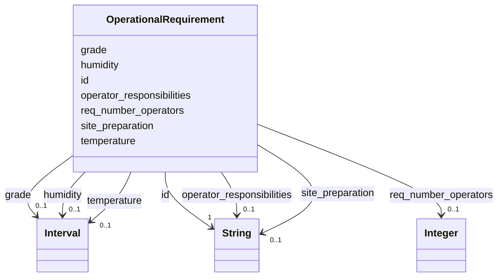

---
search:
  boost: 10.0
---

# Class: OperationalRequirement 


_CRS group 2: the site conditions and the people the robot needs to work._


<div data-search-exclude markdown="1">


URI: [rcpc:OperationalRequirement](https://rcpc.for5672/schema/OperationalRequirement)





<!-- no inheritance hierarchy -->

## Slots

| Name | Cardinality and Range | Description | Inheritance |
| ---  | --- | --- | --- |
| [id](id.md) | 1 <br/> [xsd:string](http://www.w3.org/2001/XMLSchema#string) | Identifier, unique among instances of its class | direct |
| [grade](grade.md) | 0..1 <br/> [Interval](Interval.md) | The range of ground slopes the robot can work on, recommended in degrees | direct |
| [temperature](temperature.md) | 0..1 <br/> [Interval](Interval.md) | The range of temperatures at which the robot works properly, recommended in d... | direct |
| [humidity](humidity.md) | 0..1 <br/> [Interval](Interval.md) | The range of relative humidity at which the robot works properly, recommended... | direct |
| [site_preparation](site_preparation.md) | 0..1 <br/> [xsd:string](http://www.w3.org/2001/XMLSchema#string) | What the site needs before the robot can work properly on it | direct |
| [req_number_operators](req_number_operators.md) | 0..1 <br/> [xsd:integer](http://www.w3.org/2001/XMLSchema#integer) | How many people control the robot | direct |
| [operator_responsibilities](operator_responsibilities.md) | 0..1 <br/> [xsd:string](http://www.w3.org/2001/XMLSchema#string) | What the operator does while the robot performs its tasks | direct |


## Usages

| used by | used in | type | used |
| ---  | --- | --- | --- |
| [RobotUnit](RobotUnit.md) | [operational_requirement_group](operational_requirement_group.md) | range | [OperationalRequirement](OperationalRequirement.md) |


## Identifier and Mapping Information


### Schema Source


* from schema: https://rcpc.for5672/schema/resource


## Mappings

| Mapping Type | Mapped Value |
| ---  | ---  |
| self | rcpc:OperationalRequirement |
| native | rcpc:OperationalRequirement |


## LinkML Source

<!-- TODO: investigate https://stackoverflow.com/questions/37606292/how-to-create-tabbed-code-blocks-in-mkdocs-or-sphinx -->

### Direct

<details>
```yaml
name: OperationalRequirement
description: 'CRS group 2: the site conditions and the people the robot needs to work.'
from_schema: https://rcpc.for5672/schema/resource
slots:
- id
- grade
- temperature
- humidity
- site_preparation
- req_number_operators
- operator_responsibilities

```
</details>

### Induced

<details>
```yaml
name: OperationalRequirement
description: 'CRS group 2: the site conditions and the people the robot needs to work.'
from_schema: https://rcpc.for5672/schema/resource
attributes:
  id:
    name: id
    description: Identifier, unique among instances of its class.
    from_schema: https://rcpc.for5672/schema/common
    identifier: true
    owner: OperationalRequirement
    domain_of:
    - CapabilityType
    - MaterialCategory
    - RobotUnit
    - PhysicalProperty
    - Sensor
    - OperationalRequirement
    - Safety
    - Activity
    range: string
    required: true
  grade:
    name: grade
    description: The range of ground slopes the robot can work on, recommended in
      degrees.
    from_schema: https://rcpc.for5672/schema/resource
    rank: 1000
    owner: OperationalRequirement
    domain_of:
    - OperationalRequirement
    range: Interval
    inlined: true
  temperature:
    name: temperature
    description: The range of temperatures at which the robot works properly, recommended
      in degrees Celsius.
    from_schema: https://rcpc.for5672/schema/resource
    rank: 1000
    owner: OperationalRequirement
    domain_of:
    - OperationalRequirement
    range: Interval
    inlined: true
  humidity:
    name: humidity
    description: The range of relative humidity at which the robot works properly,
      recommended in percent.
    from_schema: https://rcpc.for5672/schema/resource
    rank: 1000
    owner: OperationalRequirement
    domain_of:
    - OperationalRequirement
    range: Interval
    inlined: true
  site_preparation:
    name: site_preparation
    description: What the site needs before the robot can work properly on it.
    from_schema: https://rcpc.for5672/schema/resource
    rank: 1000
    owner: OperationalRequirement
    domain_of:
    - OperationalRequirement
    range: string
  req_number_operators:
    name: req_number_operators
    description: How many people control the robot.
    from_schema: https://rcpc.for5672/schema/resource
    rank: 1000
    owner: OperationalRequirement
    domain_of:
    - OperationalRequirement
    range: integer
  operator_responsibilities:
    name: operator_responsibilities
    description: What the operator does while the robot performs its tasks.
    from_schema: https://rcpc.for5672/schema/resource
    rank: 1000
    owner: OperationalRequirement
    domain_of:
    - OperationalRequirement
    range: string

```
</details></div>