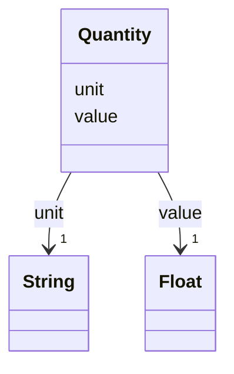

---
search:
  boost: 10.0
---

# Class: Quantity 


_A number with a unit._


<div data-search-exclude markdown="1">


URI: [rcpc:Quantity](https://rcpc.for5672/schema/Quantity)





<!-- no inheritance hierarchy -->

## Slots

| Name | Cardinality and Range | Description | Inheritance |
| ---  | --- | --- | --- |
| [value](value.md) | 1 <br/> [xsd:float](http://www.w3.org/2001/XMLSchema#float) | The numeric value | direct |
| [unit](unit.md) | 1 <br/> [xsd:string](http://www.w3.org/2001/XMLSchema#string) | The unit of the value, or of the coordinates | direct |


## Usages

| used by | used in | type | used |
| ---  | --- | --- | --- |
| [PhysicalProperty](PhysicalProperty.md) | [length](length.md) | range | [Quantity](Quantity.md) |
| [PhysicalProperty](PhysicalProperty.md) | [width](width.md) | range | [Quantity](Quantity.md) |
| [PhysicalProperty](PhysicalProperty.md) | [height](height.md) | range | [Quantity](Quantity.md) |
| [PhysicalProperty](PhysicalProperty.md) | [weight](weight.md) | range | [Quantity](Quantity.md) |
| [PhysicalProperty](PhysicalProperty.md) | [load_capacity](load_capacity.md) | range | [Quantity](Quantity.md) |
| [PhysicalProperty](PhysicalProperty.md) | [speed](speed.md) | range | [Quantity](Quantity.md) |
| [PhysicalProperty](PhysicalProperty.md) | [run_duration](run_duration.md) | range | [Quantity](Quantity.md) |
| [PhysicalProperty](PhysicalProperty.md) | [yaw](yaw.md) | range | [Quantity](Quantity.md) |
| [PhysicalProperty](PhysicalProperty.md) | [pitch](pitch.md) | range | [Quantity](Quantity.md) |
| [PhysicalProperty](PhysicalProperty.md) | [roll](roll.md) | range | [Quantity](Quantity.md) |
| [PhysicalProperty](PhysicalProperty.md) | [lifting_capacity](lifting_capacity.md) | range | [Quantity](Quantity.md) |
| [OperationalRequirement](OperationalRequirement.md) | [grade_min](grade_min.md) | range | [Quantity](Quantity.md) |
| [OperationalRequirement](OperationalRequirement.md) | [grade_max](grade_max.md) | range | [Quantity](Quantity.md) |
| [OperationalRequirement](OperationalRequirement.md) | [temperature_min](temperature_min.md) | range | [Quantity](Quantity.md) |
| [OperationalRequirement](OperationalRequirement.md) | [temperature_max](temperature_max.md) | range | [Quantity](Quantity.md) |
| [OperationalRequirement](OperationalRequirement.md) | [humidity](humidity.md) | range | [Quantity](Quantity.md) |
| [Safety](Safety.md) | [safe_distance](safe_distance.md) | range | [Quantity](Quantity.md) |
| [Safety](Safety.md) | [object_detection_range](object_detection_range.md) | range | [Quantity](Quantity.md) |
| [Safety](Safety.md) | [minimum_workspace](minimum_workspace.md) | range | [Quantity](Quantity.md) |
| [Activity](Activity.md) | [productivity](productivity.md) | range | [Quantity](Quantity.md) |
| [Activity](Activity.md) | [precision](precision.md) | range | [Quantity](Quantity.md) |
| [Activity](Activity.md) | [accuracy](accuracy.md) | range | [Quantity](Quantity.md) |


## Identifier and Mapping Information


### Schema Source


* from schema: https://rcpc.for5672/schema/common


## Mappings

| Mapping Type | Mapped Value |
| ---  | ---  |
| self | rcpc:Quantity |
| native | rcpc:Quantity |


## LinkML Source

<!-- TODO: investigate https://stackoverflow.com/questions/37606292/how-to-create-tabbed-code-blocks-in-mkdocs-or-sphinx -->

### Direct

<details>
```yaml
name: Quantity
description: A number with a unit.
from_schema: https://rcpc.for5672/schema/common
slots:
- value
- unit
slot_usage:
  value:
    name: value
    required: true
  unit:
    name: unit
    required: true

```
</details>

### Induced

<details>
```yaml
name: Quantity
description: A number with a unit.
from_schema: https://rcpc.for5672/schema/common
slot_usage:
  value:
    name: value
    required: true
  unit:
    name: unit
    required: true
attributes:
  value:
    name: value
    description: The numeric value.
    from_schema: https://rcpc.for5672/schema/common
    owner: Quantity
    domain_of:
    - Quantity
    range: float
    required: true
  unit:
    name: unit
    description: The unit of the value, or of the coordinates.
    from_schema: https://rcpc.for5672/schema/common
    owner: Quantity
    domain_of:
    - Position
    - Quantity
    range: string
    required: true

```
</details></div>