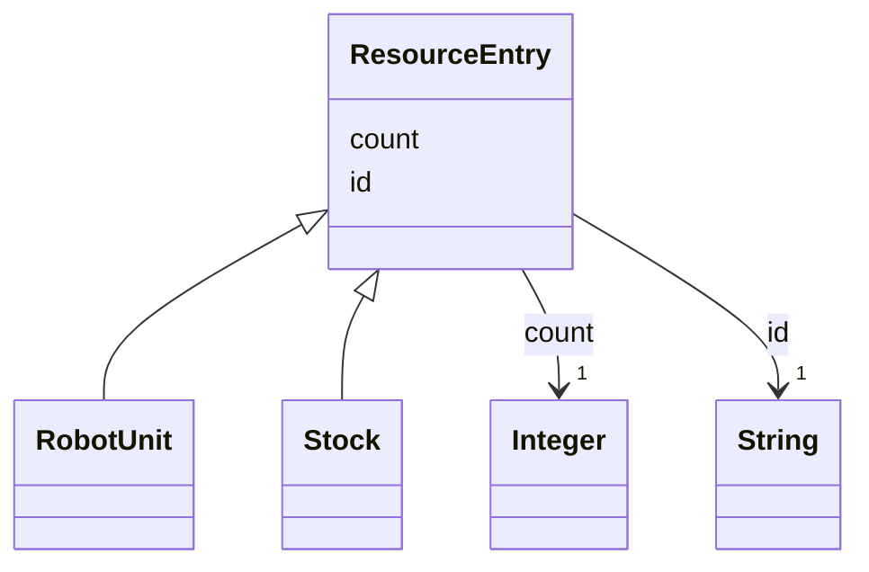

---
search:
  boost: 10.0
---

# Class: ResourceEntry 


_Something a method draws on, counted in identical units: a robot product or a stock._


<div data-search-exclude markdown="1">


URI: [rcpc:ResourceEntry](https://rcpc.for5672/schema/ResourceEntry)





## Inheritance
* **ResourceEntry**
    * [RobotUnit](RobotUnit.md)
    * [Stock](Stock.md)


## Slots

| Name | Cardinality and Range | Description | Inheritance |
| ---  | --- | --- | --- |
| [id](id.md) | 1 <br/> [xsd:string](http://www.w3.org/2001/XMLSchema#string) | Identifier, unique among instances of its class | direct |
| [count](count.md) | 1 <br/> [xsd:integer](http://www.w3.org/2001/XMLSchema#integer) | How many identical units this entry stands for: machines of a robot product, ... | direct |


## Identifier and Mapping Information


### Schema Source


* from schema: https://rcpc.for5672/schema/resource


## Mappings

| Mapping Type | Mapped Value |
| ---  | ---  |
| self | rcpc:ResourceEntry |
| native | rcpc:ResourceEntry |


## LinkML Source

<!-- TODO: investigate https://stackoverflow.com/questions/37606292/how-to-create-tabbed-code-blocks-in-mkdocs-or-sphinx -->

### Direct

<details>
```yaml
name: ResourceEntry
description: 'Something a method draws on, counted in identical units: a robot product
  or a stock.'
from_schema: https://rcpc.for5672/schema/resource
slots:
- id
- count

```
</details>

### Induced

<details>
```yaml
name: ResourceEntry
description: 'Something a method draws on, counted in identical units: a robot product
  or a stock.'
from_schema: https://rcpc.for5672/schema/resource
attributes:
  id:
    name: id
    description: Identifier, unique among instances of its class.
    from_schema: https://rcpc.for5672/schema/common
    identifier: true
    owner: ResourceEntry
    domain_of:
    - CapabilityType
    - MaterialCategory
    - ResourceEntry
    - PhysicalProperty
    - Sensor
    - OperationalRequirement
    - Safety
    - Activity
    range: string
    required: true
  count:
    name: count
    description: 'How many identical units this entry stands for: machines of a robot
      product, or units of a stock.'
    from_schema: https://rcpc.for5672/schema/resource
    rank: 1000
    owner: ResourceEntry
    domain_of:
    - ResourceEntry
    range: integer
    required: true
    minimum_value: 1

```
</details></div>