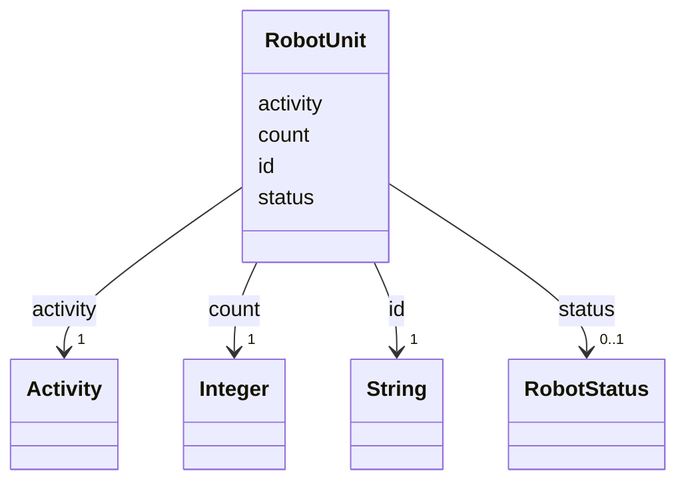

---
search:
  boost: 10.0
---

# Class: RobotUnit 


_One robot product, entered from its Construction Robot Schema attributes. Identical machines are one entry with a count._


<div data-search-exclude markdown="1">


URI: [rcpc:RobotUnit](https://rcpc.for5672/schema/RobotUnit)





<!-- no inheritance hierarchy -->

## Slots

| Name | Cardinality and Range | Description | Inheritance |
| ---  | --- | --- | --- |
| [id](id.md) | 1 <br/> [xsd:string](http://www.w3.org/2001/XMLSchema#string) | The robot's name, a readable product slug | direct |
| [count](count.md) | 1 <br/> [xsd:integer](http://www.w3.org/2001/XMLSchema#integer) | How many identical machines this entry stands for | direct |
| [status](status.md) | 0..1 <br/> [RobotStatus](RobotStatus.md) | The runtime state of one machine | direct |
| [activity](activity.md) | 1 <br/> [Activity](Activity.md) | The Activity group holding this robot's offered capabilities | direct |


## Identifier and Mapping Information


### Schema Source


* from schema: https://rcpc.for5672/schema/resource


## Mappings

| Mapping Type | Mapped Value |
| ---  | ---  |
| self | rcpc:RobotUnit |
| native | rcpc:RobotUnit |


## LinkML Source

<!-- TODO: investigate https://stackoverflow.com/questions/37606292/how-to-create-tabbed-code-blocks-in-mkdocs-or-sphinx -->

### Direct

<details>
```yaml
name: RobotUnit
description: One robot product, entered from its Construction Robot Schema attributes.
  Identical machines are one entry with a count.
from_schema: https://rcpc.for5672/schema/resource
slots:
- id
- count
- status
- activity
slot_usage:
  id:
    name: id
    description: The robot's name, a readable product slug. The CRS Name.
  activity:
    name: activity
    required: true

```
</details>

### Induced

<details>
```yaml
name: RobotUnit
description: One robot product, entered from its Construction Robot Schema attributes.
  Identical machines are one entry with a count.
from_schema: https://rcpc.for5672/schema/resource
slot_usage:
  id:
    name: id
    description: The robot's name, a readable product slug. The CRS Name.
  activity:
    name: activity
    required: true
attributes:
  id:
    name: id
    description: The robot's name, a readable product slug. The CRS Name.
    from_schema: https://rcpc.for5672/schema/common
    identifier: true
    owner: RobotUnit
    domain_of:
    - CapabilityType
    - RobotUnit
    - Activity
    range: string
    required: true
  count:
    name: count
    description: How many identical machines this entry stands for.
    from_schema: https://rcpc.for5672/schema/resource
    rank: 1000
    owner: RobotUnit
    domain_of:
    - RobotUnit
    range: integer
    required: true
    minimum_value: 1
  status:
    name: status
    description: The runtime state of one machine.
    from_schema: https://rcpc.for5672/schema/resource
    rank: 1000
    ifabsent: RobotStatus(idle)
    owner: RobotUnit
    domain_of:
    - RobotUnit
    range: RobotStatus
  activity:
    name: activity
    description: The Activity group holding this robot's offered capabilities.
    from_schema: https://rcpc.for5672/schema/resource
    rank: 1000
    owner: RobotUnit
    domain_of:
    - RobotUnit
    range: Activity
    required: true
    inlined: true

```
</details></div>