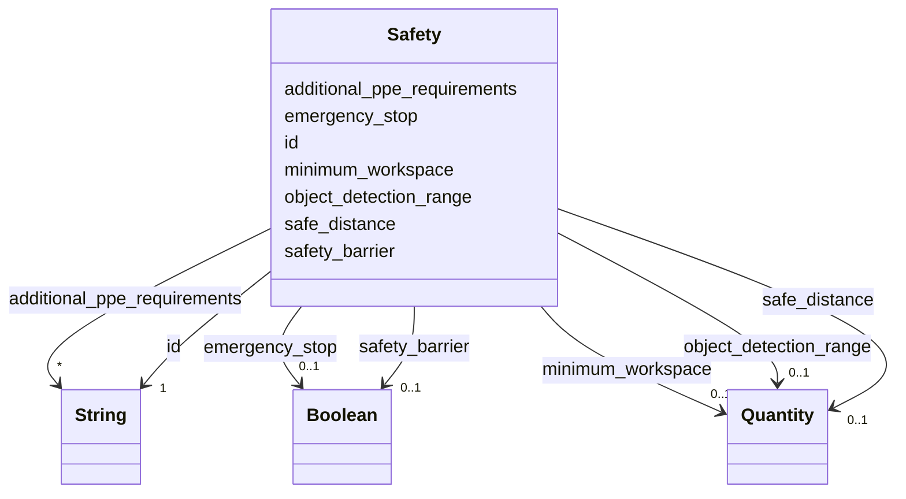

---
search:
  boost: 10.0
---

# Class: Safety 


_CRS group 3: how the robot protects the people and objects around it._


<div data-search-exclude markdown="1">


URI: [rcpc:Safety](https://rcpc.for5672/schema/Safety)





<!-- no inheritance hierarchy -->

## Slots

| Name | Cardinality and Range | Description | Inheritance |
| ---  | --- | --- | --- |
| [id](id.md) | 1 <br/> [xsd:string](http://www.w3.org/2001/XMLSchema#string) | Identifier, unique among instances of its class | direct |
| [emergency_stop](emergency_stop.md) | 0..1 <br/> [xsd:boolean](http://www.w3.org/2001/XMLSchema#boolean) | Whether the robot stops automatically and immediately when specific condition... | direct |
| [safe_distance](safe_distance.md) | 0..1 <br/> [Quantity](Quantity.md) | The minimum distance to keep between humans and the robot while they work tog... | direct |
| [object_detection_range](object_detection_range.md) | 0..1 <br/> [Quantity](Quantity.md) | How far away the robot can detect and recognise objects, recommended in metre... | direct |
| [safety_barrier](safety_barrier.md) | 0..1 <br/> [xsd:boolean](http://www.w3.org/2001/XMLSchema#boolean) | Whether the robot has a facility to avoid collisions with humans or objects | direct |
| [additional_ppe_requirements](additional_ppe_requirements.md) | * <br/> [xsd:string](http://www.w3.org/2001/XMLSchema#string) | Extra personal protective equipment required when humans operate or work with... | direct |
| [minimum_workspace](minimum_workspace.md) | 0..1 <br/> [Quantity](Quantity.md) | The minimum space the robot needs to operate without collisions, recommended ... | direct |


## Usages

| used by | used in | type | used |
| ---  | --- | --- | --- |
| [RobotUnit](RobotUnit.md) | [safety_group](safety_group.md) | range | [Safety](Safety.md) |


## Identifier and Mapping Information


### Schema Source


* from schema: https://rcpc.for5672/schema/resource


## Mappings

| Mapping Type | Mapped Value |
| ---  | ---  |
| self | rcpc:Safety |
| native | rcpc:Safety |


## LinkML Source

<!-- TODO: investigate https://stackoverflow.com/questions/37606292/how-to-create-tabbed-code-blocks-in-mkdocs-or-sphinx -->

### Direct

<details>
```yaml
name: Safety
description: 'CRS group 3: how the robot protects the people and objects around it.'
from_schema: https://rcpc.for5672/schema/resource
slots:
- id
- emergency_stop
- safe_distance
- object_detection_range
- safety_barrier
- additional_ppe_requirements
- minimum_workspace

```
</details>

### Induced

<details>
```yaml
name: Safety
description: 'CRS group 3: how the robot protects the people and objects around it.'
from_schema: https://rcpc.for5672/schema/resource
attributes:
  id:
    name: id
    description: Identifier, unique among instances of its class.
    from_schema: https://rcpc.for5672/schema/common
    identifier: true
    owner: Safety
    domain_of:
    - CapabilityType
    - MaterialCategory
    - ResourceEntry
    - PhysicalProperty
    - Sensor
    - OperationalRequirement
    - Safety
    - Activity
    range: string
    required: true
  emergency_stop:
    name: emergency_stop
    description: Whether the robot stops automatically and immediately when specific
      conditions are triggered.
    from_schema: https://rcpc.for5672/schema/resource
    rank: 1000
    owner: Safety
    domain_of:
    - Safety
    range: boolean
  safe_distance:
    name: safe_distance
    description: The minimum distance to keep between humans and the robot while they
      work together, recommended in metres.
    from_schema: https://rcpc.for5672/schema/resource
    rank: 1000
    owner: Safety
    domain_of:
    - Safety
    range: Quantity
    inlined: true
  object_detection_range:
    name: object_detection_range
    description: How far away the robot can detect and recognise objects, recommended
      in metres.
    from_schema: https://rcpc.for5672/schema/resource
    rank: 1000
    owner: Safety
    domain_of:
    - Safety
    range: Quantity
    inlined: true
  safety_barrier:
    name: safety_barrier
    description: Whether the robot has a facility to avoid collisions with humans
      or objects.
    from_schema: https://rcpc.for5672/schema/resource
    rank: 1000
    owner: Safety
    domain_of:
    - Safety
    range: boolean
  additional_ppe_requirements:
    name: additional_ppe_requirements
    description: Extra personal protective equipment required when humans operate
      or work with the robot.
    from_schema: https://rcpc.for5672/schema/resource
    rank: 1000
    owner: Safety
    domain_of:
    - Safety
    range: string
    multivalued: true
  minimum_workspace:
    name: minimum_workspace
    description: The minimum space the robot needs to operate without collisions,
      recommended in metres.
    from_schema: https://rcpc.for5672/schema/resource
    rank: 1000
    owner: Safety
    domain_of:
    - Safety
    range: Quantity
    inlined: true

```
</details></div>