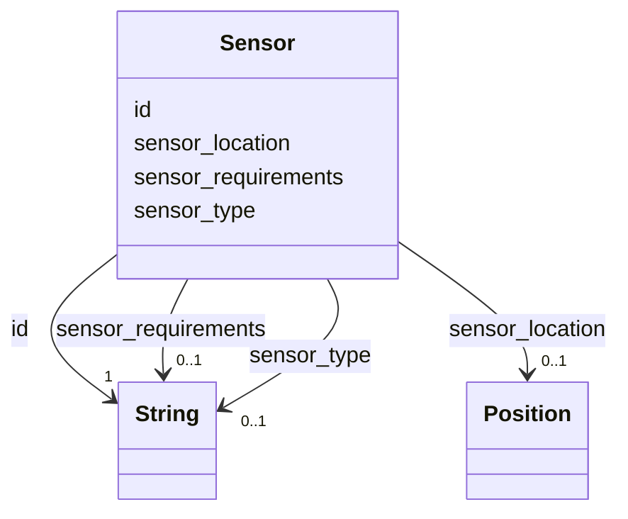

---
search:
  boost: 10.0
---

# Class: Sensor 


_One sensor on or around the robot. Belongs to the PhysicalProperty group one hop down._


<div data-search-exclude markdown="1">


URI: [rcpc:Sensor](https://rcpc.for5672/schema/Sensor)





<!-- no inheritance hierarchy -->

## Slots

| Name | Cardinality and Range | Description | Inheritance |
| ---  | --- | --- | --- |
| [id](id.md) | 1 <br/> [xsd:string](http://www.w3.org/2001/XMLSchema#string) | Identifier, unique among instances of its class | direct |
| [sensor_type](sensor_type.md) | 0..1 <br/> [xsd:string](http://www.w3.org/2001/XMLSchema#string) | What kind of sensor this is | direct |
| [sensor_requirements](sensor_requirements.md) | 0..1 <br/> [xsd:string](http://www.w3.org/2001/XMLSchema#string) | What installing the sensor requires | direct |
| [sensor_location](sensor_location.md) | 0..1 <br/> [Position](Position.md) | Where the sensor sits on the robot, a point in the robot's own frame | direct |


## Usages

| used by | used in | type | used |
| ---  | --- | --- | --- |
| [PhysicalProperty](PhysicalProperty.md) | [sensors](sensors.md) | range | [Sensor](Sensor.md) |


## Identifier and Mapping Information


### Schema Source


* from schema: https://rcpc.for5672/schema/resource


## Mappings

| Mapping Type | Mapped Value |
| ---  | ---  |
| self | rcpc:Sensor |
| native | rcpc:Sensor |


## LinkML Source

<!-- TODO: investigate https://stackoverflow.com/questions/37606292/how-to-create-tabbed-code-blocks-in-mkdocs-or-sphinx -->

### Direct

<details>
```yaml
name: Sensor
description: One sensor on or around the robot. Belongs to the PhysicalProperty group
  one hop down.
from_schema: https://rcpc.for5672/schema/resource
slots:
- id
- sensor_type
- sensor_requirements
- sensor_location

```
</details>

### Induced

<details>
```yaml
name: Sensor
description: One sensor on or around the robot. Belongs to the PhysicalProperty group
  one hop down.
from_schema: https://rcpc.for5672/schema/resource
attributes:
  id:
    name: id
    description: Identifier, unique among instances of its class.
    from_schema: https://rcpc.for5672/schema/common
    identifier: true
    owner: Sensor
    domain_of:
    - CapabilityType
    - RobotUnit
    - PhysicalProperty
    - Sensor
    - OperationalRequirement
    - Safety
    - Activity
    range: string
    required: true
  sensor_type:
    name: sensor_type
    description: What kind of sensor this is.
    from_schema: https://rcpc.for5672/schema/resource
    rank: 1000
    owner: Sensor
    domain_of:
    - Sensor
    range: string
  sensor_requirements:
    name: sensor_requirements
    description: What installing the sensor requires.
    from_schema: https://rcpc.for5672/schema/resource
    rank: 1000
    owner: Sensor
    domain_of:
    - Sensor
    range: string
  sensor_location:
    name: sensor_location
    description: Where the sensor sits on the robot, a point in the robot's own frame.
    from_schema: https://rcpc.for5672/schema/resource
    rank: 1000
    owner: Sensor
    domain_of:
    - Sensor
    range: Position
    inlined: true

```
</details></div>